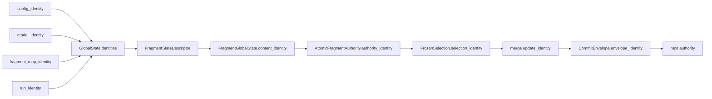

# 系统架构与详细设计

## 1. 设计目标

当前实现围绕五个直接目标组织：

1. learner 独立训练，不因其他 learner、quorum 或 syncer 速度形成训练 barrier；
2. steady state 只交换 fragment，不重复传完整模型；
3. 同一个 fragment 的 global state 只有一个逻辑写者；
4. reader 只观察到完整旧状态或完整新状态，且 proposal 最多成功消费一次；
5. discovery、内存和权威状态的大小由 `M`、`F`、fragment size、`S_max` 决定，不随历史轮数增长。

实现采用“不可变大 payload + 可原子替换的小 visibility record”。payload 文件可以残留，但不会成为 authority；visibility record 才决定当前可见对象。

## 2. 角色与所有权

| 角色/组件 | 持有状态 | 可写内容 | 明确不能做的事 |
|---|---|---|---|
| learner 进程 | 完整本地 HF 模型、独立 AdamW、数据 shard、每 fragment progress/base、最多一 pending 和一 in-flight snapshot/fragment | 自己的 proposal fixed slots；自己的日志/结果 | 不能写 global current；不能初始化 DDP/NCCL/RPC |
| syncer 进程 | 每 fragment current authority、proposal cache、readiness round、outer optimizer state、进度计数 | 所有 fragment 的 global current slots；GC/inventory/log | 不能训练模型；正式 NumPy merge 路径不导入 Torch/CUDA |
| POSIX storage | 不可变 payload、visibility records、临时 record、retirement marker | 由各角色通过 `PosixStorageBackend` 写 | 不提供事务日志、历史 replay 或跨 fragment global head |
| evaluation snapshot | 捕获时刻的 authority vector 和独立复制的 state payload | 新建一次性目录 | loader 不能读 `current`/`latest`/`visibility` |

所有 global fragment 共享一个逻辑 syncer，但 authority 是 per-fragment 的；fragment `f` 的版本推进不要求 fragment `g` 同时推进。

## 3. 分层设计

### 3.1 common

- `identity.py` 提供唯一的 canonical JSON 规则和 SHA-256 身份。
- `logging.py` 以 JSONL 记录带 UTC、monotonic time、PID、run/role 的事件，并按配置 `fsync`。

### 3.2 model

- `learner_assets.py` 冻结模型、tokenizer、dataset 和训练 profile，校验 Hub revision、文件 checksum，并把文本确定性打包为按 block index 轮转分配的 uint32 shard。
- `model_registry.py` 把 HF 模型识别为 embedding、完整 blocks、lm_head；tied parameter 只保留一个 owner；misc parameter 按相邻层字节较小侧确定性归属。
- `fragment_map.py` 在不拆层、连续、非空约束下求三层目标：最小最大 fragment bytes，其次最小总偏差，最后取字典序最早 cuts。
- `model_state.py` 以 safetensors 冻结每个 fragment，用于通用 bootstrap 资产。
- `evaluation.py` 冻结一个跨 fragment version vector，生成只能按 manifest 精确重载的 evaluation 目录。

### 3.3 protocol

- `storage.py` 是 STOR-01 的 POSIX 实例：先写唯一 payload，再写临时 visibility JSON，最后 `os.replace`。
- `proposal.py` 定义 proposal 编码、latest-wins store、资格判断、确定性选择、消费前沿与 inverse-staleness 权重。
- `global_state.py` 定义 compound fragment state、bounded base history、bootstrap 和 CAS 风格 successor publication。
- `global_commit.py` 把 outer optimizer state、selection facts 和 consumption frontiers 嵌进 global state 的 `outer_state` section，使它们随参数一起成为一个 authority。

### 3.4 learner

- `runtime.py` 执行 inner training，并在每个 optimizer step 完成后发出 `SafeBoundaryEvent`。
- `publication.py` 在 safe boundary 按 H/offset 快照 due fragments，并由每 fragment 一个后台 worker 做 bounded latest-wins publication。
- `adoption.py` 后台轮询每个 global current slot，保留每 fragment 最新 pending state，再在 safe boundary 只覆盖目标 fragment，同时保留 AdamW state。

### 3.5 syncer

- `readiness.py` 管理每 fragment `WAITING → GRACE → FROZEN → ACTIVE` 状态机、固定 slot discovery 和 round-robin claim。
- `merge.py` 逐个读取 contribution，计算 `base-local`，以 fp32 累加并执行 fragment-wise SGD/momentum/Nesterov。
- `profile_a.py` 把 discovery、readiness、merge、atomic commit 和 progress 串成 Stage 1 executor。

## 4. 身份与信任边界

身份链从宽到窄如下：



各 identity 的作用不同：

- `GlobalStateIdentities` 防止 run/config/model/fragment-map 混用；
- descriptor 固定 fragment index、identity、dtype、shape、parameter identities；
- proposal `content_identity` 绑定 base/progress/payload checksum；
- state `content_identity` 绑定版本、参数、outer state、base history；
- authority identity 额外绑定消费前沿；
- selection identity 绑定 authority、按序 proposals 和 float32 weights；
- update identity 绑定 current、ordered contributions、merge policy、outer policy 和 fragment map；
- envelope identity 绑定 frontiers、selected facts、outer optimizer bytes 和上一次 authority。

因此仅修改一个 JSON 字段、重用别的 run payload、在同版本替换内容、或把 selection 应用到另一个 authority 都会在某个边界失败关闭。

## 5. 并发模型

### 5.1 learner 内部

- 主线程：forward/backward/optimizer、safe-boundary observer、CPU→GPU adoption。
- publication：每个 fragment 一个 daemon worker；该 fragment 最多一个 `in_flight`，外加一个可替换的 `pending`。
- adoption poller：单 daemon 线程；每轮读取 `F` 个 current records，只在 record version 前进时读取大 payload。
- snapshot 和 adoption coordinator 各自加锁；真实 runner 固定 observer 顺序为 publication 后 adoption，使刚完成的 step 仍归旧 base，随后 adoption 重置计数并更新下一次 snapshot 的 base context。

### 5.2 syncer 内部

- readiness 对所有 `M×F` fixed proposal slots 轮询；支持 bound record backend 时，先读 metadata，再并行解码所有变化的 payload。
- readiness 全局最多一个 active `UpdateLease`，确保当前实现一次只执行一个 fragment merge/commit。
- 多个 fragment 同时 frozen 时从 round-robin cursor 开始选择，claim 后 cursor 前移，避免高频 fragment 饥饿其他 fragment。
- `AtomicGlobalCommitStore` 使用 `RLock` 串行 load/commit 和 authority cache；`GlobalStateStore` 还要求提交使用刚从 expected visibility record 解码的同一个 state 对象。

## 6. 核心不变量如何落到代码

| 不变量 | 实现位置与机制 |
|---|---|
| learner 独立前进 | `LearnerRuntime._run_owned` 不读取 quorum；publication/adoption 使用后台 worker/poller；observer 只处理本 learner 的有限状态 |
| fragment 单写者 | runner 只在 syncer 构造 `AtomicGlobalCommitStore`；commit 还验证 expected record 未变化 |
| 参数与 outer state 共同可见 | `CommitEnvelope` 编码进 `FragmentGlobalState.outer_state`，整个 global state 是单一 storage payload，单一 current record 指向它 |
| proposal 完整后可见 | `PosixStorageBackend.publish` 先完成 `.bin`，再 `os.replace` `.json`；reader 校验 size + SHA-256 |
| 一人一票 | `select_candidates` 先按 learner 分组，每 learner 只留排序第一项；`FrozenSelection` 和 commit 再验重 |
| 一次性消费 | `ConsumptionFrontier` 保存 last sequence/base；selection、commit 和 envelope 三层验证单调性 |
| mixed-version model | adoption 按 fragment 独立应用；progress 是 version vector，不存在统一 model version |
| 有界 discovery | proposal slot 是 `sha256(learner_id) × fragment_index` 固定空间；poll 不扫描 payload 历史 |
| 有界 state | current state 只保留 `S_max+1` bases；publisher/poller cache 均按 fragment 或 `M×F` 固定大小 |
| telemetry 非 authority | logger 只接收已经产生的 event/trace；selection 和 commit 不读取日志 |

## 7. 数值设计

对选中的 proposal `i`：

```text
s_i = current_version - base_version_i
r_i = processed_tokens_i / (1 + lambda_s * s_i)
w_i = float32(r_i) / float32(sum_j r_j)
g_i = G(base_i) - L_i
g_merge = sum_i float32(w_i * g_i)
```

outer SGD：

```text
momentum == 0: direction = g_merge
momentum > 0:  buffer = momentum * old_buffer + g_merge
nesterov:      direction = g_merge + momentum * buffer
otherwise:     direction = buffer
G_next = G_current - learning_rate * direction
```

关键点是 `g_i` 从 proposal 声明且验证过的 base 计算，而 outer update 总是作用于当前参数。Torch streaming 路径可以通过 `StreamingBaseSource` 处理旧 base；正式 Profile A NumPy 路径明确要求 `base_version == current_version`。

## 8. 复杂度与容量上界

设 learner 数 `M`、fragment 数 `F`、当前 fragment 字节数 `B_f`、参与者数 `K≤M`。

| 操作 | 时间/IO | 常驻或峰值状态 |
|---|---|---|
| proposal discovery | 每 poll `O(MF)` metadata；只对变化 slot 读取 payload | latest proposal cache `O(MF)` |
| learner publication | 每 due fragment 写一个 `B_f` payload | 每 learner/fragment ≤1 pending + ≤1 in-flight |
| adoption discovery | 每 poll `O(F)` metadata | 每 fragment ≤1 pending state |
| merge | `O(K·B_f)`；fresh-only 无 retained-base read | 张量峰值是少量 `B_f`，不是 `K·B_f` |
| commit | 写一个包含 parameters、outer envelope、bounded bases 的 compound payload | base entries ≤`S_max+1` |
| authority memory | `O(F)` current authority + selected/cache facts | 不保存 update 历史 |
| physical storage | GC 前可有 orphan payload | correctness 只依赖 fixed records；GC 失败影响空间而非 authority |

## 9. 失败模型

- payload 写入前/中断：visibility 未变化，reader 仍看旧对象；唯一 payload 成为 orphan。
- visibility 临时 record 写入中断：current record 未变化；临时文件可 GC。
- `os.replace` 前中断：旧 authority；replace 后中断：新 authority。
- proposal worker 出错：该 fragment slot 标记 failed，pending 被标为 abandoned，错误在 `drain`/`raise_if_failed` 重新抛出。
- adoption poller 出错：后台线程停止；下一 safe boundary 或 close 通过 `raise_if_failed` 抛出。
- merge/commit 出错：readiness lease 被 `release` 回 FROZEN，可在修正后重试；若相同 request 已经成功可见，atomic commit 识别 duplicate retry。
- syncer/learner 进程重启：底层 state 具备恢复所需 authority，但本目录没有完成 Stage 3 的进程恢复编排、inner optimizer checkpoint 或 proposal sequence 安全跳变策略。

