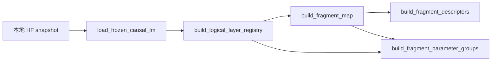
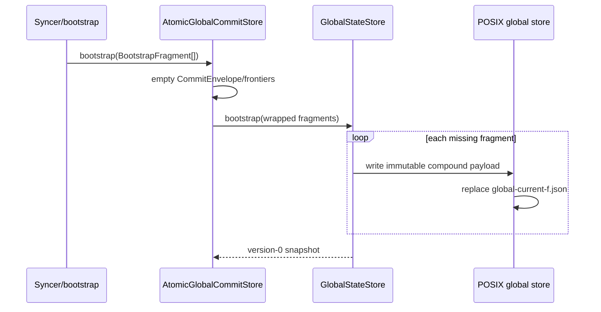
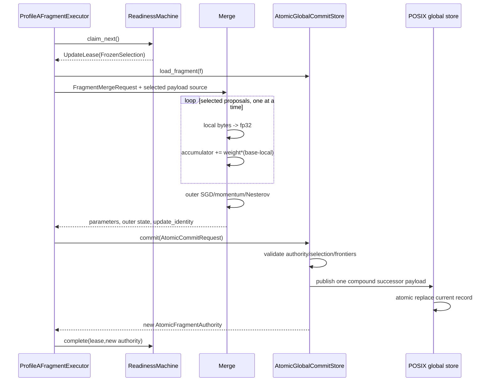

# 端到端详细流程

本章以实际 Stage 1 编排 [`close.py`](../../src/fsbdd/auxiliary/stage1/close.py) 为组合示例，但每一步都落到 `src/fsbdd/diloco` 的具体 API。当前主路径是 fresh-only Profile A。

## 1. 离线资产准备

### 1.1 冻结 profile 与 Hub 资产

1. `load_learner_profile` 严格读取 JSON：字段必须完整且不能多；model/tokenizer/dataset revision 必须是 40 位 commit；模型和 tokenizer 必须同 repository/revision；训练 optimizer 只能是 AdamW，scheduler 只能是按 local optimizer step 的 constant。
2. `verify_profile_assets` 用 profile 中的字节数和 SHA-256 校验本地 Hub snapshot，禁止网络 fallback。
3. `materialize_packed_shards` 逐批读 parquet text：只跳过空串、不 normalization、不加 special tokens、每行末尾加 EOS，把连续 token stream 切成固定长度 block。
4. 第 `b` 个 block 写入 shard `b mod shard_count`，文件为 little-endian uint32；先写临时目录，完成 manifest 和 marker 后 `os.replace` 成目标目录。
5. learner 启动时 `validate_materialized_shards(..., required_shard_index=i)` 校验全部 metadata 和自己的 shard checksum，避免每个 learner 重复 hash 其他大 shard。

### 1.2 模型结构与 fragment map



1. `load_frozen_causal_lm` 以 fp32 加载，再移到指定 device，核对参数量。
2. `build_logical_layer_registry` 展开 trainable parameter aliases；tied embedding/head 只归 embedding owner；misc module 根据两侧当前同步字节数归较小一侧，平局归左侧；所有 buffer 必须显式声明为可由 config 重建。
3. `build_fragment_map` 动态规划连续分区，产出固定 digest、每层/每 fragment 参数身份和字节统计。
4. `build_fragment_descriptors` 生成 flat-fp32 descriptor；`build_fragment_parameter_groups` 把 descriptor 顺序映射回实际 parameter objects。

## 2. Bootstrap

真实 Stage 1 运行使用 atomic bootstrap：

1. syncer 构造两套独立 `PosixStorageBackend`：`protocol/global` 与 `protocol/proposals`。
2. 以相同 `GlobalStateIdentities` 和 descriptors 构造 `GlobalStateStore`、`ProposalStore`。
3. `AtomicGlobalCommitStore.bootstrap` 对每个 bootstrap fragment 构造空 `CommitEnvelope`：frontier 全是 `(-1,-1)`，selected 为空，previous/selection/update identity 都为零。
4. envelope 被编码为 fragment state 的 `outer_state`，再由 `GlobalStateStore.bootstrap` 发布 version 0 current state。
5. bootstrap 可幂等恢复：已有 fragment 若与预期 state 完全相同就列入 `existing_indices`；不同则拒绝；缺失项才发布。
6. 每个 fragment 独立发布，因此 bootstrap 中断后可再次执行并补齐，最终 `load_snapshot` 形成 version vector `[0,...,0]`。



通用 CLI `fsbdd bootstrap` 直接调用 `GlobalStateStore.bootstrap`，不会自动加入 atomic consumption envelope；它适合普通 global-state bootstrap plan，而不是 Profile A executor 的完整 atomic authority。

## 3. Learner 启动

每个 learner 独立执行：

1. 校验 profile、Hub assets、materialized shard 和 CUDA/bf16 能力。
2. 加载模型，重新构造 registry/fragment map，并要求 digest 与 bootstrap 资产一致。
3. `atomic.load_snapshot()` 取得所有 fragment current authority；把每个 flat fp32 payload 逐段写回完整本地模型。
4. 构造独立 AdamW、`LearnerProgress.initialize`、`PackedTokenShard`、`ConstantStepScheduler` 和 `LearnerRng`。
5. 构造 `FragmentPublicationSchedule`、`FragmentSnapshotCoordinator`。
6. 构造 `FragmentAdoptionCoordinator`，其 `LatestFragmentPoller` 开始后台轮询 global fixed slots。
7. 构造 `LearnerRuntime`。实际 observer 顺序固定为：

```python
(publisher.on_safe_boundary, adoption.on_safe_boundary)
```

这个顺序保证当前 step 的快照使用 step 开始前的 adopted base；随后 adoption 才覆盖参数、重置该 fragment counters，并通过 `publisher.update_adopted_base_context` 更新下一 step 的 base identity。

## 4. 一个 learner optimizer step

```mermaid
flowchart TD
    B[PackedTokenShard.next_batch] --> MOVE[batch 搬到 device]
    MOVE --> FW[HF forward + scalar loss]
    FW --> BW[(loss × target_count).backward]
    BW --> MORE{还有 accumulation microbatch?}
    MORE -- 是 --> B
    MORE -- 否 --> NORM[所有 grad / 总 target tokens]
    NORM --> CLIP[clip_grad_norm error_if_nonfinite]
    CLIP --> OPT[AdamW.step]
    OPT --> LR[scheduler.step]
    LR --> ZERO[zero_grad set_to_none]
    ZERO --> COUNT[更新 learner/fragment counters]
    COUNT --> EVENT[构造 SafeBoundaryEvent]
    EVENT --> PUB[publisher observer]
    PUB --> ADOPT[adoption observer]
    ADOPT --> LOG[JSONL safe_boundary]
```

精确计数规则：

- `processed_input_tokens` 是 attention mask 中的 active input 数；
- `loss_bearing_target_tokens` 是 shift 后 active 且 label 不为 `-100` 的 target 数；
- 每个 microbatch 的 HF mean loss 先乘 target 数，所有 microbatch 相加后再除总 target 数；
- 梯度在 optimizer step 前除以总 target 数，因此 gradient accumulation 不按 microbatch mean 等权；
- local step 只在一次完整 `optimizer.step()` 后加一；所有 fragment 的 since-adoption step/token counter 同步累加；
- 发生异常时先 `zero_grad` 再抛出，不产生 safe boundary。

`LearnerRng.activate` 把 learner 自己的 CPU/CUDA RNG state 临时安装进 Torch，全程用 `fork_rng` 隔离；退出后保存新 owned state，并验证进程全局 RNG 已恢复。

## 5. Snapshot 与 proposal publication

### 5.1 due 计算

`FragmentPublicationSchedule.is_due` 使用：

```text
(local_optimizer_step - offset_f) mod H_f == 0
```

`unified` factory 以 fragment byte-weighted midpoint 选择 offset；当 `H>=F` 时为每个 fragment 选择不同 offset。真实运行也可直接从冻结配置传入 intervals/offsets。

### 5.2 safe-boundary staging

`FragmentSnapshotCoordinator.on_safe_boundary`：

1. 核对 event 与共享 `LearnerProgress` 完全一致，要求 local step 严格前进且所有 parameter `.grad is None`。
2. 对每个 due fragment 先递增并保留 proposal sequence。staging 失败会留下 sequence gap，但不会复用 identity。
3. 按 fragment parameter group 顺序把 tensor detach、转 CPU/fp32/contiguous，串接为 little-endian fp32 bytes；校验有限值和准确字节数。
4. 生成 `StagedFragmentSnapshot`，记录 base version/content、since-adoption steps/tokens、safe boundary 和 GPU→CPU 时间。
5. 提交给 bounded publisher；大 payload 的 SHA-256 和 proposal semantic identity 在后台 worker 中计算，减少 safe-boundary 停顿。

### 5.3 bounded publisher

每个 fragment 的 slot 状态是：

```text
pending: 0/1（未开始，可被更大 sequence 替换）
in_flight: 0/1（已开始，内容不可变）
worker: 1
```

- 小于等于已提交最高 sequence 的 snapshot 标为 `skipped_nonmonotonic`；
- 新 snapshot 到达而 pending 尚未开始时，旧 pending 标为 `replaced_before_publish`；
- worker 把 pending 移到 in-flight，物化 `Proposal`，调用 `ProposalStore.publish`；
- 失败会把 slot 标为 failed，清理 in-flight，把尚存 pending 标为 `abandoned_after_failure`，并由前台 drain/close 重抛；
- 成功后记录 payload bytes、materialization、CPU→FS 时间和 terminal trace。

### 5.4 proposal store publication

1. `ProposalStore._validate_for_publish` 验 run/model/map/fragment/learner、正 progress 和冻结上限。
2. 同 learner/fragment 使用非阻塞 lock，禁止两个正式 publication 同时进行。
3. 先读 current latest record：sequence/base 不能倒退；相同 sequence+相同 content 返回幂等结果，相同 sequence+不同 content 拒绝。
4. `encode_proposal` 形成 `FSBDDPR1 + header length + canonical header + parameter bytes`。
5. storage 写唯一 payload，最后替换 fixed visibility record。旧 publication 即使延迟完成，也会因 store 层 sequence/base 回退检查而不能把 latest 倒退。

## 6. Syncer discovery 与 readiness

### 6.1 fixed-slot poll

每轮 `SyncerReadinessMachine.poll_store` 访问所有 `M×F` slots：

- 没有 bound-record 能力：调用 `load_latest_if_changed`；backend 有 metadata read 时仍尽量只在 payload identity 变化后解码；
- POSIX bound-record 路径：先顺序读取所有小 record，把变化的 slots 收集起来，再在线程池并行 `load_bound_record`；安装 cache 时仍按冻结的扫描顺序处理；
- record sequence/base 不可倒退，相同 sequence 的 record/content 不可改变；
- cache 保存每 learner/fragment 最新 proposal、record 和 payload identity，大小 `O(MF)`。

### 6.2 eligibility 与 grace

`observe` 对每个非 frozen/active fragment：

1. 用 permissive policy 调 `select_candidates` 得到所有 eligible distinct proposals；
2. 资格依次检查 frozen identities、未消费 sequence/base、正 progress、上限、非 future、`s<=S_max`、retained base 和 base content identity；
3. 同 learner 多项按 `staleness ↑, effective tokens ↓, sequence ↓, learner id, proposal id` 排序，只留第一项；
4. 若 distinct ≥`Q` 且 fresh ≥`Q_fresh`：WAITING 进入 GRACE；grace 为 0 时直接冻结；
5. grace 中 quorum 丢失则回 WAITING；deadline 到时用当时 eligible 顺序截到 `max_contributors`，计算 float32 normalized weights，形成不可变 `FrozenSelection`。

当前 Profile A 是 `Q=Q_fresh=M`、grace=0、`S_max=0`，所以 selection 全部 fresh。

### 6.3 公平 claim

`claim_next` 只在没有 active lease 时工作，从 cursor 开始循环 fragments，找到第一个 FROZEN，生成全局递增 `claim_ordinal`，转 ACTIVE，并把 cursor 移到下一个 fragment。更新失败可 `release` 回 FROZEN；成功用 `complete` 安装新 authority 并回 WAITING。

## 7. Merge 与 atomic commit



`ProfileAFragmentExecutor.execute_next` 的具体顺序：

1. 可选 poll；claim 一个 lease；加载 current authority，必须等于 selection 冻结的 authority/version。
2. 将 proposal+weight 转为 `ContributionFact`，由 `_SelectedProposalSource` 每次只暴露一个 immutable bytes。
3. 构造 `FragmentMergeRequest`。Profile A outer state 中空 bytes 表示没有 momentum buffer。
4. Torch 或 NumPy merge 计算 successor 和 `update_identity`；正式 Stage 1 syncer 选择 NumPy backend，保证 CPU-only 且不导入 Torch。
5. 构造 `AtomicCommitRequest`，要求 `next_version=current+1`，selection facts/weight 和 request 完全一致。
6. atomic store 重新加载 current；若 version 已是 next 且全部 request facts 一致，返回 `duplicate_retry=True`；否则同 version 不同内容失败。
7. 计算新 consumption frontiers，构造包含 selected facts、previous authority、selection、update 和 outer optimizer bytes 的 envelope。
8. `GlobalStateStore.publish_successor_from_current` 要求提交对象是从 expected record 验证过的同一 state；发布前和 visibility hook 中都再次要求 current record 未变化。
9. 新 state 的 version 和 outer_update_count 都加一，base history 截到 `S_max+1`；参数、envelope、base history 一起编码并由一个 record 发布。
10. 成功后 readiness 安装新 authority，progress tracker 累加 accepted tokens 和 fresh/stale count。

消费前沿只在成功 successor 可见时包含进新 envelope；publication 在 replace 前失败，旧 state 仍携带旧 frontiers，因此 proposal 未被消费。

## 8. Learner discovery 与 adoption

### 8.1 后台 poll

`LatestFragmentPoller.poll_once` 每轮读取 `F` 个 current records：

1. record version 不得低于已观察最高版本；同版本 record 不得改变；
2. 若 version 不高于 adopted/pending known version，只计 unchanged/current/stale，不读大 payload；
3. 新 version 用 bound record 精确读取该 immutable payload；
4. 构造 `PendingFragmentAdoption`，记录 record/state、发现时已完成 step 和 FS→CPU 时间；
5. 每 fragment 只留最新 pending，更高 version 替换旧 pending，所以 learner 可从 `v` 直接采用 `v+k`。

### 8.2 safe-boundary apply

`FragmentAdoptionCoordinator.on_safe_boundary`：

1. 先检查 poller 后台错误和 safe boundary；
2. 一次取走所有 fragment pending；
3. 对每项解析 flat fp32 bytes，按实际 parameter shapes 切分为 CPU tensors；
4. `torch.no_grad()` 下只覆盖目标 fragment parameters，转换为本地 parameter dtype/device，CUDA 时同步目标 devices；
5. 目标 fragment 的 version 更新，since-adoption step/token 清零；proposal sequence 不清零；其他 fragment counters/version 不变；
6. 调 base context sink，使 publisher 下一 proposal 声明新 base；再让 poller `mark_adopted`；
7. 可选 `identity_audit` 验非目标参数未变、fp32 目标等于 payload、所有 inner optimizer state hash/entry count 完全不变。

in-flight proposal 不会被修改：它已经包含旧 base identity；learner 可在它上传期间采用新 global fragment。fresh-only syncer 会把它判为 stale/不合格；未来 stale-aware 路径可按真实旧 base 处理。

## 9. Evaluation snapshot

1. `FrozenEvaluationPlan.capture` 一次加载所有 atomic authorities，先在内存中冻结 version vector、content identities、frontiers 和 policy。
2. `materialize_evaluation_snapshot` 新建目录；每个 authority 重新编码为独立 `fragments/fragment-N.state`，写完并 fsync；最后写 canonical `manifest.json`。
3. loader 先读一次 manifest，然后只读 manifest 明确命名的 state 文件。
4. `EvaluationAccessAudit` 拒绝任何逃出 root、包含 current/latest/visibility 或非声明路径的 read。
5. 每个 state 重解码 global state + commit envelope，并逐项对比 manifest 的 version、content、authority、descriptor、policy、frontier、bytes/checksum。

这保证 evaluation 使用捕获时的 mixed-version vector，而不是逐 fragment 加载时追逐不断变化的 current。

## 10. 进度、停止与清理

- `ProfileAProgressTracker` 分开记录 learner local steps/tokens 和 fragment outer update/accepted tokens；`global_cycle=min(fragment.outer_update_count)`。
- `FrozenStopPolicy` 可按 global cycles、walltime、compute steps、accepted tokens 或 FLOPs 停止，按字段优先级返回第一个满足原因；真实 `close.py` 还使用冻结 gate contract 控制 workload。
- syncer 定期调用 `reclaim_unreferenced_payloads`。当前 record 指向的 payload 永不删；最近若干 orphan 和小于安全年龄的 orphan 保留；删除失败只影响空间。
- learner 完成时先 drain/close publisher，再 close adoption poller，最后 fsync structured log；syncer 最终输出 progress/readiness/inventory，并声明未使用 network/full-model/history scan。

