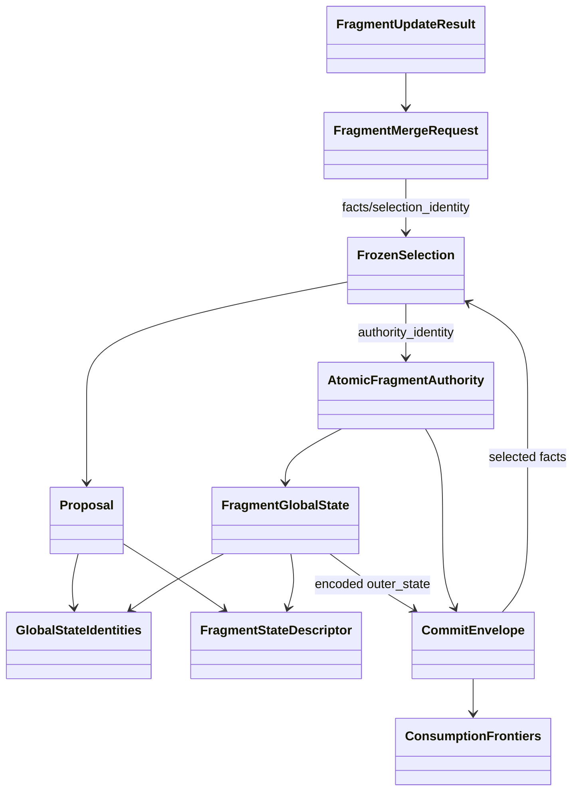

# 数据流与存储格式

## 1. 总体数据流

```mermaid
flowchart LR
    DATA[packed uint32 shard] --> LR[LearnerRuntime]
    MODEL[local full model] --> LR
    LR -->|SafeBoundaryEvent| SNAP[SnapshotCoordinator]
    SNAP -->|flat fp32 fragment bytes| PPROP[Proposal compound payload]
    PPROP -->|immutable payload + latest record| PFS[(proposal FS)]
    PFS -->|M×F fixed-slot discovery| READY[ReadinessMachine]
    READY -->|FrozenSelection| MERGE[streaming merge]
    MERGE -->|parameters + outer state + update identity| COMMIT[Atomic commit]
    COMMIT -->|compound authority| GFS[(global FS)]
    GFS -->|F fixed-slot discovery| ADOPT[Adoption poller]
    ADOPT -->|target fragment tensors| MODEL
    GFS -->|frozen vector| EVAL[evaluation snapshot]
```



训练输入 token 只在 learner 本地流动；learner→syncer 传完整本地 fragment 参数；syncer→learner 传完整 global fragment 参数。proposal 不是 gradient/delta，global publication 也不是完整模型 checkpoint。

## 2. POSIX backend 物理布局

对每个 `PosixStorageBackend(root)`：

```text
root/
├── payloads/
│   └── <uuid>.bin                 # 不可变 compound payload
├── visibility/
│   └── <slot>.json                # 当前可见的小 canonical record
├── .record-tmp/
│   └── <slot>-<uuid>.json         # replace 前的临时 record
└── .retired/
    └── <old-payload-name>.json    # 失去引用的时间标记
```

真实 Stage 1 进一步分成：

```text
shared_root/protocol/
├── global/       # GlobalStateStore/AtomicGlobalCommitStore
└── proposals/    # ProposalStore
```

固定 slot：

| 对象 | slot 公式 | 数量上界 |
|---|---|---|
| global current | `global-current-{fragment_index:06d}` | `F` |
| proposal latest | `proposal-{sha256(learner_id)}-{fragment_index:06d}` | `M×F` |

slot 名中 learner 使用 hash，避免任意 learner string 进入路径；backend 还要求 slot 符合最长 128 字符的固定 grammar。

## 3. Visibility record

`PublicationRecord` 是 canonical JSON，最大 64 KiB：

```json
{
  "base_content_identity": "<sha256>",
  "complete": true,
  "dtype": "float32",
  "fragment_identity": "...",
  "fragment_map_identity": "<sha256>",
  "payload_bytes": 123,
  "payload_identity": "<sha256>",
  "payload_relative_path": "payloads/<uuid>.bin",
  "payload_sha256": "<sha256>",
  "run_identity": "...",
  "schema_version": 1,
  "sequence": 7,
  "shape": [1000],
  "version": 3
}
```

`payload_identity` 当前必须等于 `payload_sha256`。对 proposal，record `version=base_version`、`sequence=proposal sequence`；对 global state，两者都等于 fragment global version。

发布顺序：

1. 在 `payloads/` 用 `xb` 新建 UUID 文件，循环写直到所有 bytes 完成，并 `fstat` 验 regular file 和准确 size；
2. 默认 hash immutable source bytes；诊断模式可重新打开并逐字节 readback；
3. 在 `.record-tmp/` 写 canonical complete record；
4. 若已有 current record，先写 `.retired` marker；
5. 调用 visibility hook 做上层 CAS/检查；
6. `os.replace(temp, visibility/<slot>.json)` 原子切换可见性。

reader 先以 `O_NOFOLLOW` 打开 regular record，验证 schema/canonical/expectation，再以 record 的确切相对路径打开 payload，验证 size+SHA-256。`read_bound_record` 不再次解析 latest slot，避免 metadata 已冻结后发生 TOCTOU 跳转。

## 4. Proposal compound payload

二进制格式：

```text
offset  size        内容
0       8           ASCII magic "FSBDDPR1"
8       8           big-endian uint64 header_length
16      header_len  canonical JSON header
...     remaining   完整本地 fragment 参数，little-endian fp32
```

header 绑定：proposal id、四层 frozen identities、learner、完整 descriptor、sequence、base version/content、local steps、processed tokens、snapshot local step，以及 payload kind/dtype/shape/bytes/SHA-256。`Proposal.content_identity` 是不含自身 identity 的上述语义对象的 canonical digest。

proposal 的关键数据语义：

| 字段 | 来源 | 用途 |
|---|---|---|
| `sequence` | learner/fragment 单调 reservation | latest 单调与最多消费一次 |
| `base_version` | snapshot 时 adopted progress | staleness 和 consumed-base |
| `base_content_identity` | snapshot coordinator 的 adopted base context | 防止同版本错误内容或错误 run base |
| `local_steps`, `processed_tokens` | 自上次 adoption 后计数 | progress cap、quorum telemetry、weight |
| `snapshot_local_step` | learner 全局 local optimizer step | safe-boundary审计 |
| `parameters` | due fragment 的本地完整 fp32 值 | `G_base-L_local` |

## 5. Global state compound payload

二进制格式：

```text
offset  size        内容
0       8           ASCII magic "FSBDDGS2"
8       8           big-endian uint64 header_length
16      header_len  canonical JSON header (schema v2)
...     variable    current parameters
...     variable    outer_state（Profile A 中是 CommitEnvelope）
...     variable    旧 base sections；current base 复用 parameters，不重复写
```

header 包含 identities、descriptor、version、outer update count、previous base content identity、base version vector、section sizes/checksums 和 `content_identity`。`base_history[-1].parameters` 必须与 current parameters 是同一内容；版本连续且末项等于 current version。

version 0 的 `base_content_identity` 是 64 个零；非零版本必须是前一个 state 的 `content_identity`。successor history：

```text
history_next = (history_current + current-successor parameters/version)[-(S_max+1):]
```

注意：这里的 retained base `content_identity` 由 state chain 表达；`BaseSnapshot` 自身保存 version、parameters 和 parameter checksum。

## 6. CommitEnvelope

`FragmentGlobalState.outer_state` 在 atomic path 中不是裸 momentum bytes，而是：

```text
"FSBDDCM1" + uint64 header_length + canonical header + outer_optimizer_state bytes
```

header 包含：

- `policy_identity`；
- `previous_authority_identity`；
- `selection_identity`；
- `update_identity`；
- 每 learner 固定一行的 `last_sequence/last_base_version`；
- 本次 selected contribution facts（proposal/content/base/tokens/staleness/weight/checksum/bytes）；
- outer optimizer state bytes/checksum；
- envelope identity。

bootstrap envelope selected 为空，其三个 previous/selection/update identities 必须全零。非 bootstrap envelope selected 非空、learner/proposal 不重复、weights 以 float32 累加后在 `2e-6` 绝对误差内为 1，且每个 selected contribution 必须等于相应 committed frontier。

因此一个 current visibility record 原子地指向：

```text
parameters
+ current version/identity
+ bounded base history
+ outer optimizer state
+ consumed sequence/base frontiers
+ exact selected/update provenance
```

不存在分别读取“最新参数文件”和“最新 optimizer 文件”的拼接窗口。

## 7. 内存数据对象关系



## 8. 读写矩阵

| 阶段 | 读取 | 写入 | 大 payload 次数 |
|---|---|---|---|
| bootstrap | 每 fragment current record/state（检查是否已有） | 缺失 fragment state + current record | 每缺失 fragment 1 写 |
| learner snapshot | 本地 parameter tensors | proposal payload + latest record | 每 due fragment 1 写 |
| syncer poll | 每 `M×F` proposal record；变化项 payload | 无 | 每变化 slot 最多 1 读 |
| merge | selection 中 K 个 proposal bytes；stale 时相关 old base | 内存 successor | fresh-only K 读，stale 增加 old base 读 |
| atomic commit | current record/state（通常 cache/metadata） | successor compound state + current record | 1 写 |
| learner poll | 每 `F` global record；新版本 payload | 无 | 每新 fragment version 1 读 |
| adoption | pending state 内存 bytes | 本地目标 fragment tensors | 无 FS IO |
| evaluation capture | 每 `F` atomic current authority | `F` frozen state + 1 manifest | F 读 + F 写 |
| GC/inventory | visibility metadata、目录项、retirement marker | 删除足龄 orphan/temp | 不读取 tensor 内容做 inventory |

## 9. 计数数据流

```mermaid
flowchart LR
    STEP[optimizer.step] --> LP[learner local_optimizer_steps]
    TOK[input active tokens] --> LT[learner processed_input_tokens]
    LP --> FP[fragment local_steps_since_adoption]
    LT --> FT[fragment tokens_since_adoption]
    FP --> PROP[proposal local_steps]
    FT --> PROP2[proposal processed_tokens]
    PROP2 --> ACC[accepted_tokens on successful commit]
    COMMIT[successful fragment publication] --> OUT[fragment outer_update_count]
    OUT --> CYCLE[global_cycle=min(all fragments)]
    ADOPT[fragment adoption] --> RESET[only target FP/FT reset]
```

proposal sequence 不因 adoption 清零；fragment since-adoption counters 会清零。accepted tokens 是被 selection 成功提交的 proposal `processed_tokens` 之和，不等于 learner 总处理 tokens，也不等于 loss-bearing target tokens。

## 10. Evaluation 目录格式

```text
snapshot_root/
├── manifest.json
└── fragments/
    ├── fragment-000000.state
    ├── fragment-000001.state
    └── ...
```

manifest 为 canonical JSON+换行，记录完整 version/content/authority vectors、每 state 相对路径/bytes/SHA、parameters bytes/SHA、learner ids、policy identity、snapshot identity 和 capture time。目录必须是新目录；任何已存在目标都会拒绝，避免半覆盖旧 evaluation。

## 11. 数据不进入 authority 的部分

以下信息用于观察但不参与选择/提交正确性：

- `StructuredLogger` JSONL；
- snapshot/publication/adoption trace；
- byte/memory/latency accounting；
- storage inventory 和 GC 统计；
- evaluation access audit；
- loss、gradient norm、throughput、update norm；
- `ProfileAProgressTracker` 的报告对象（真实 authority 仍是 global state/envelope）。

日志损坏不应使旧 proposal 重新合格，也不能让 state 变为 current；authority 完全由可验证的 visibility record、compound payload 和 frozen identity chain 决定。

