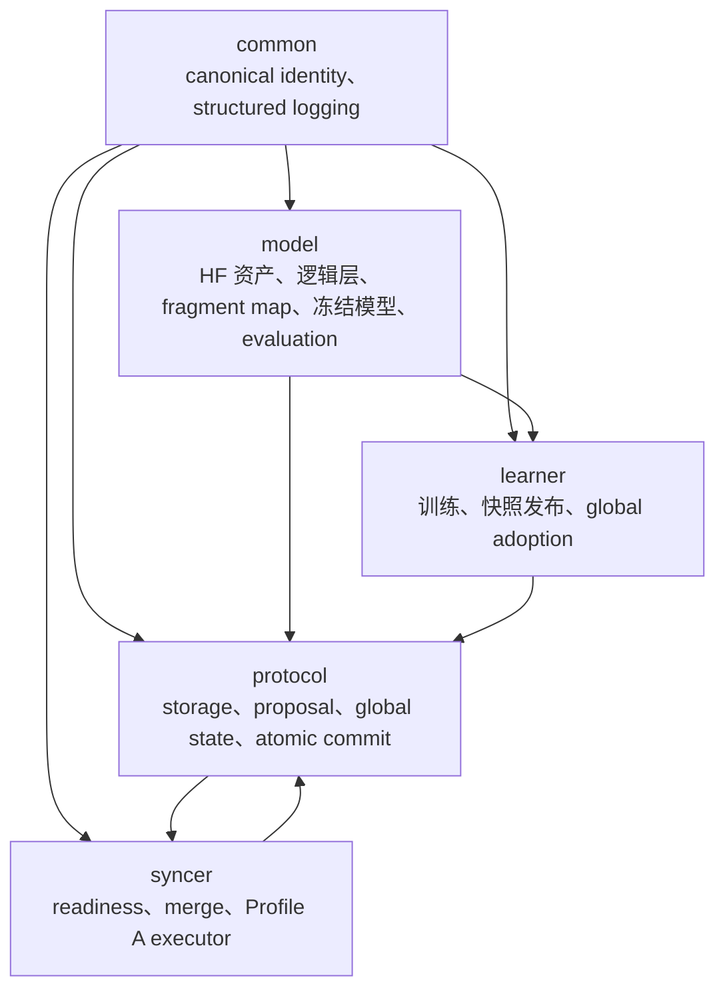

# `fsbdd.diloco` 实现详解

本文档集描述当前 `src/fsbdd/diloco` 的实际实现，而不是把未来规划当成已经存在的功能。阅读代码基线为 2026-07-16 工作树中的提交 `be784db5498a1506269ea84c6931e5592f48700a`；文档中的行号用于定位，代码后续变更时应以符号名和实际源码为准。

## 一句话概括

该系统让多个互不通信的单 GPU learner 各自训练完整模型，只在完整 optimizer step 后按 fragment 发布本地参数快照；单个 CPU syncer 通过共享文件系统发现快照，按 distinct learner quorum 冻结候选，执行 token 加权的 base-relative merge 和 fragment 级 outer SGD，再把“新参数、outer optimizer state、消费前沿、版本”作为一个原子可见的复合状态发布。learner 分 fragment 发现和采用新版本，因此本地模型允许是 mixed-version model。

## 当前实现边界

| 能力 | 当前代码状态 |
|---|---|
| 模型 | Hugging Face dense causal LM；内建识别 GPT-NeoX、Llama、GPT-2，也允许显式映射 |
| fragment | 完整逻辑层、前向连续、按 fp32 同步字节做确定性最优划分 |
| learner | 自定义 PyTorch 训练循环，AdamW，fp32/bf16，禁止 `torch.distributed` |
| 数据面 | 仅共享存储；proposal 和 global state 都使用固定 visibility slot + 不可变 payload |
| syncer | 单逻辑 syncer、CPU merge、round-robin 公平调度 |
| Stage 1 主路径 | Profile A：`Q=M`、`Q_fresh=M`、`S_max=0`、grace=0、direct weighted averaging |
| stale-ready 基础 | proposal 带 base version/content identity；通用 eligibility、权重、base history 已参数化 |
| 尚未在集成提交路径启用 | `S_max>0`。`ReadinessConfig` 和 `AtomicGlobalCommitStore` 明确拒绝非零 `S_max`；NumPy Profile A merge 也只接受 current-base contribution |
| 容错语义 | publication 是 crash-consistent 的旧/新二选一；完整 Stage 3 自动恢复流程不在此包内实现 |
| evaluation | 先冻结完整 fragment version vector，再只读取 manifest 指定的不可变 payload；禁止追逐 current/latest |

特别注意：[`proposal.py`](../../src/fsbdd/diloco/protocol/proposal.py) 的 `EligibilityPolicy`、`select_candidates` 和 `compute_candidate_weights` 支持一般的有限 staleness；[`global_state.py`](../../src/fsbdd/diloco/protocol/global_state.py) 也支持 `S_max+1` base window。但当前端到端 authority/ready/commit 路径仍是 Stage 1 fresh-only。不能仅凭底层通用函数就宣称系统已启用 stale-aware 训练。

## 模块地图

这里存在一个有意的类型级环：`protocol.global_commit` 使用 `syncer.readiness.FrozenSelection` 作为提交请求的冻结选择类型，而 `syncer.readiness` 又读取 protocol proposal/global state。运行时不存在网络回调环；它表达的是“selection 先冻结，commit 再验证”的边界。

## 文档导航

1. [系统架构与详细设计](01-architecture.md)：角色、组件、状态所有权、不变量、并发模型和复杂度。
2. [端到端详细流程](02-processes.md)：启动、learner step、proposal、syncer update、adoption、evaluation 和停止流程。
3. [数据流与存储格式](03-data-flow-and-storage.md)：对象关系、二进制格式、目录布局、身份链和读写矩阵。
4. [common/model 函数级参考](04-functions-common-model.md)。
5. [protocol 函数级参考](05-functions-protocol.md)。
6. [learner 函数级参考](06-functions-learner.md)。
7. [syncer 函数级参考](07-functions-syncer.md)。

## 代码入口

`src/fsbdd/diloco` 本身主要提供库对象。两个实际编排入口是：

- [`src/fsbdd/cli.py`](../../src/fsbdd/cli.py)：通用 `fsbdd bootstrap` 只构造 `GlobalStateStore` 并发布普通 bootstrap state；learner/syncer 子命令目前只有 dry-run。
- [`src/fsbdd/auxiliary/stage1/close.py`](../../src/fsbdd/auxiliary/stage1/close.py)：Stage 1 真实运行编排。它分别构造 learner 和 syncer 进程中的 store/runtime/coordinator/executor，并用共享文件系统中的 coordination JSON 启停角色。该编排层不是本文函数参考的主体，但 [端到端流程](02-processes.md) 会指出它如何组合 `diloco` API。

## 术语

| 术语 | 精确定义 |
|---|---|
| current authority | 某个 fragment 当前可见的 `FragmentGlobalState + CommitEnvelope` 组合 |
| content identity | 对对象的规范化语义字段做 SHA-256；与物理 payload 文件名无关 |
| base | learner 生成 proposal 时实际采用的 global fragment state |
| proposal | learner 的完整本地 fragment 参数值及其 base/progress 身份，不是 delta |
| pseudo-gradient | `G_base - L_local` |
| outer update | 将加权 pseudo-gradient 作用到当前 `G_current` 和当前 outer optimizer state，产生 fragment version `v+1` |
| frontier | 每个 learner/fragment 的 `(last_sequence, last_base_version)` 固定大小消费记录 |
| safe boundary | 一个完整 inner `optimizer.step()`、scheduler step 和 `zero_grad` 之后的边界 |
| global cycle | 所有 fragment outer update count 的最小值 |

