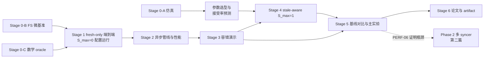

# FS-Based Decoupled DiLoCo：从启动到论文完成的研究总计划

## 0. 文档定位

本文是**研究总计划**，回答四个问题：研究主张是什么、按什么顺序推进、每一步实现哪些特性、达到什么指标才算通过。

实现层面的规范性契约见 [STAGE0-4_SPEC.md](STAGE0-4_SPEC.md)（Stage 0–4 需求与设计规格，下称 Spec）；本文引用其条款 ID（INV/DISC/SIM/BENCH/MODEL/FRAG/LEARN/PROP/STALE/SYNC/OPT/GLOBAL/FS/PROG/PERF/REC-xx 与验收 A-xx）。Stage 5–6 与 Phase 2 的实验设计以本文为准，Spec §1.4 保证实现不阻碍它们。

### 0.1 三项关键设计决定

1. **stale 支持分阶段实现，但为必选特性**：Stage 1–3 以 S_max=0 配置运行（接口通用、行为先收窄，见 Stage 1 实现纪律与 Spec §1.6），Stage 4 无条件实现 S_max=1；Stage 0-A 仿真只用于参数选型与接受率预测，不决定 stale 取舍；若 H3 不成立，stale 作为 matched 对照下的负面结果如实报告。
2. **崩溃一致性与恢复在范围内**（Stage 3，Spec §7）：存储上有界权威状态使 crash-consistent restart 几乎免费，这是相对网络方案最不对称的优势，必须作为论文卖点而不是 non-goal。范围限定为 kill-restart 级别，不做 exact replay。
3. **fragment 策略默认 layer-aligned 连续均衡分片**（Spec §5.2；FRAG-05 的字节均衡目标已吸收大部分带宽收益）；balanced-tensor 作为 Stage 5 可选消融，论文中引用原论文"质量对分片策略稳健"的结论作为依据。

### 0.2 一句话研究陈述

> DiLoCo 系算法把同步频率降低了约两个数量级，使通信介质的延迟容忍度从微秒级放宽到秒级。我们据此论证：**存储本身可以充当去中心化预训练的通信介质**——协议只依赖"原子可见性发布"与"最终可读"两个存储原语，以单写者、有界状态的最小协调实现 Decoupled DiLoCo，天然获得崩溃一致的重启能力，并以有界 stale 聚合回收 fresh-only 语义下被丢弃的异构算力。POSIX 共享文件系统（HPC 中心，介质是被迫选择）与对象存储（跨区域高延迟环境）是同一协议的两个实例化；本篇主实验在前者上完成，并以可见性延迟扫描刻画协议的适用边界。

---

## 1. 研究问题、假设与论文主张

### 1.1 动机场景（论文第一节，必须写实）

**主场景（评估在此完成）**：HPC 中心的共享存储环境——介质是被迫选择：

- 多个 GPU 作业分属不同节点/分区/集群，共享同一 Lustre / GPFS / NFS / CHFS 文件系统；
- 作业之间不能建立长驻网络服务（调度器限制、防火墙、跨集群无路由）；
- 作业由批调度器独立启动、随时可能被抢占或重启；
- 现有替代方案（NCCL/RPC 参数服务器）在该场景下**不可部署**，而非仅仅不方便。

写作要求：给出至少一个具体机构/系统配置作为实例，并在 Stage 0 用该 FS 的实测特性数据支撑"场景真实"这一前提。

**次级主张（一般化，claim 与证据必须匹配）**：协议不依赖 POSIX 语义整体，只依赖两个存储原语——"原子可见性发布"（POSIX FS 上为原子 rename；对象存储上为原子 PUT / 条件写）与"最终可读"。因此同一协议可实例化到跨区域共享对象存储，覆盖 Decoupled DiLoCo 式高延迟环境中"参与方之间只有存储可达"的变体。证据要求：Stage 5 的注入式可见性延迟扫描（goodput 随延迟的退化曲线与可行域）+ Stage 0-B 可选的对象存储微基准；**不承诺真实跨区域实验**，论文措辞相应限定。

注意切割：Decoupled DiLoCo 原文运行于跨区域 WAN，但仍以 RPC 在线服务通信——高延迟本身不构成使用存储介质的理由，"只有存储可共享"才是。

### 1.2 研究问题与假设

| ID | 研究问题 | 可证伪假设 |
|---|---|---|
| RQ1 | 共享 FS 能否作为 decoupled DiLoCo 的唯一通信介质，代价多大？ | **H1**：在 fragment 同步周期 ≥ 30s 的配置下，FS 传输开销占比 < 10%，learner GPU goodput ≥ 网络实现的 90% |
| RQ2 | FS 承载权威状态是否带来免费容错？ | **H2**：syncer/learner 任意时刻 kill -9 后重启，训练无损继续，恢复到下一次成功 outer update 的时间 ≤ 2× 正常 update 间隔，且不需要任何 replay |
| RQ3 | 有界 stale 聚合能否在异构速度下提升样本吸收率而不损害质量？ | **H3**：在速度异构（最慢/最快 ≥ 1.5×）下，S_max=1 相比 fresh-only 将 accepted-token 效率提升 ≥ 10 个百分点，matched-token 最终 eval loss 差异在多种子噪声（±1σ）内 |
| RQ4 | 单 syncer 何时成为瓶颈，非重叠分片能否线性扩展？ | **H4**（第二阶段/第二篇）：非重叠多 syncer 在相同输入下数值等价，且聚合吞吐随 syncer 数近线性 |
| RQ5 | 协议的适用边界在哪里——可见性延迟多大时失效？ | **H5**：goodput 退化由"可见性延迟 ÷ fragment 同步周期"之比决定：比值 ≤ 5% 时 goodput 损失 ≤ 2%，且该曲线可外推对象存储/跨区域场景的可行域 |

### 1.3 论文主张（claims）与证据映射

| Claim | 内容 | 证据来源（Stage） |
|---|---|---|
| C1 | 最小存储协调协议（单写者 + payload-first/visibility-last + 有界状态）足以正确支撑 decoupled DiLoCo，正确性只依赖"原子可见性发布 + 最终可读"两个存储原语（POSIX FS 以原子 rename 实例化） | Stage 0-B、1 |
| C2 | 稳态 goodput 代价可量化且小（对照网络基线），且适用边界（goodput vs 可见性延迟）可刻画 | Stage 2、5 |
| C3 | 崩溃一致重启免费获得（对照：网络版 synchronizer 崩溃需状态重建） | Stage 3 |
| C4 | 有界 stale 聚合在异构下提升吸收率、质量无损（对照 fresh-only；与 FedAsync 式衰减正面区分） | Stage 0-A、4 |
| C5 | 发现成本、存储、单次 update 成本均有界，1000+ updates 无退化 | Stage 5 |

C1/C2/C3/C5 构成系统主线；C4 为算法副线，**无条件实现与评估**（§0.1 决定 1），其在论文中的篇幅由 Stage 0-A 的预测与 Stage 4 的实测共同决定；若 H3 不成立，则作为 matched 对照下的负面结果报告。

### 1.4 相关工作切割面（写作前必须完成的定位）

1. **DiLoCo / Streaming DiLoCo / Decoupled DiLoCo**：算法机制（quorum、grace window、token 加权、fragment 通信）来自原论文；本工作的 delta = 传输介质（存储 vs 网络在线服务）+ 崩溃一致性 + 有界 stale 扩展。注意：原论文在高延迟 WAN 上以 fresh-only 工作良好，因此 stale 的动机是回收异构下被丢弃的算力，而非"高延迟必需"。不得声称聚合算法本身为新贡献。
2. **异步联邦聚合（FedAsync、FedBuff、gap-aware/DC-ASGD）**：`tokens/(1+λs)` 属多项式 staleness 衰减一族，必须引用并区分：本工作以 fragment 版本为 staleness 单位、以 Q_fresh 锚定、base-relative displacement 重建（Spec INV-07），而非梯度延迟补偿。
3. **基于存储/checkpoint 的训练系统**（弹性 checkpoint、Gemini、CheckFreq 一类）：它们用存储做容错，本工作用存储做**数据面通信**。
4. **参数服务器**：结构相似（中心聚合），但 PS 假设常驻网络服务与在线 RPC；本工作假设仅有文件系统与批作业。
5. **RDA（Radial-Directional Averaging）**：来自 Decoupled DiLoCo 原论文的 merge 策略，论文中必须给出定义与引用，不作为本工作贡献。

---

## 2. 实验总纲（所有阶段共用）

### 2.1 模型与数据

| 用途 | 模型 | 数据 | token 预算 | 种子数 |
|---|---|---|---|---|
| 调试 / 数值验证 | ~160M dense decoder-only（Pythia/LLaMA 风格） | FineWeb-Edu 或 C4，按 learner 独立 shard | 1–3B | 1 |
| 质量主张（C4、matched-token 对照） | 160M–410M | 同上 | 接近 chinchilla（~3–8B） | **≥ 3** |
| 系统主张（C1/C2/C3/C5、长跑） | 0.5–1B | 同上 | ~5–10B（以系统稳态为目的，不追求收敛最优） | 1 |

原则：质量结论在小模型多种子上建立统计效力；系统结论在最大可负担规模上建立代表性。二者不混用。

### 2.2 环境

- learner：M = 4（调试）/ M = 8+（主实验），每 learner 1 GPU、1 node（Spec §1.1）；
- syncer：1 CPU node；
- FS：目标共享文件系统至少一种真实并行 FS（Lustre / GPFS / CHFS），NFS 可作对照点；
- 异构场景：**至少一个真实来源**（不同代 GPU 混用，或共享节点争用），外加注入式减速（如单 learner 恒定 ×0.7 减速、lognormal 抖动）用于参数扫描。仅有注入式异构不足以支撑 C4。

### 2.3 方法论红线（Spec §10 报告要求）

- 任何 stale-aware 结论必须同时给出 fresh-only 对照；
- 任何质量比较必须 matched-token，任何效率比较必须 matched-compute 或 matched-communication，并显式标注口径；
- 不得把"stale 提高吸收率"与"更多通信/更多 outer updates 的质量效应"混为一谈；
- 所有 run 的超参数在启动前冻结入实验记录。

### 2.4 核心度量定义（全文统一口径）

| 指标 | 定义 |
|---|---|
| GPU goodput | learner 训练吞吐（tokens/s）÷ 同配置关闭全部通信的本地吞吐 |
| accepted-token 效率 | 被成功聚合吸收的 token 数 ÷ 所有 learner 实际处理的 token 数 |
| discard rate | 因 base 版本失效/超限被拒的 proposal 占比（按 token 加权） |
| adoption lag | global fragment 发布到 learner 实际采用之间的本地步数/时间 |
| update interval | 同一 fragment 相邻两次成功 outer update 的间隔 |
| 恢复时间 | 进程重启到该角色首次成功完成其主循环动作（learner：首个 inner step；syncer：首次成功 publication） |

---

## 3. 阶段总览

Stage 0 的三项工作相互独立、可并行。Stage 4 可与 Stage 5 的基线搭建部分并行。

---

## 4. 分阶段计划

### Stage 0：预研验证（不写系统代码）——预计 2–3 周，三线并行

进入条件：无。这是全项目第一步，目的是在投入实现前锁定三个最大的不确定性。

#### Stage 0-A：离散事件仿真（参数选型与接受率预测）

实现内容：
- 几百行级别的仿真器：M 个 learner（速度从给定分布采样）、F 个 fragment、交错发布调度（H、offset）、quorum Q、grace window、fresh-only 与 S_max∈{1,2} 的接受规则、可配置的传输/可见性延迟；
- 扫描参数：M ∈ {4,8,16}、Q/M ∈ {0.5,0.75,1}、异构比 ∈ {1.0,1.5,2,3}、grace ∈ {0, 0.1H, 0.25H}、可见性延迟 ∈ {0, 1s, 5s, 30s}；
- 输出：discard rate、accepted-token 效率、fragment update interval 分布、stale 接受率与挽回幅度预测。

交付物：仿真代码 + 参数扫描报告（直接作为论文 motivation 图与 Stage 4 验收的预测锚点）。

**用途（§0.1 决定 1，Spec §2 SIM-05）**：仿真不决定 stale 是否实现——stale 为必选。它的三个用途：(1) 选型 S_max、λ、Q、grace、offset 的默认值；(2) 给出 stale 挽回幅度预测，Stage 4 验收要求实测与预测一致（偏差 ≤ 2×）；(3) 预估不同可见性延迟下的丢弃率，为 Stage 5 延迟扫描划定测点。

仿真预测只影响论文篇幅，不影响实现范围：

| 预测的 stale 挽回幅度（accepted-token 效率提升） | 对论文的影响 |
|---|---|
| ≥ 10 个百分点 | C4 作为第二贡献，主文完整章节 |
| 3–10 个百分点 | C4 保留，篇幅压缩 |
| < 3 个百分点 | C4 移至消融/讨论；同时检查调度参数是否掩盖了收益 |

#### Stage 0-B：目标 FS 微基准（论文一手数据）

实现内容（Spec §3）：
- 跨节点可见性延迟分布（写→另一节点可读，p50/p99）；
- rename/link 原子性压测：并发读写下 ≥ 10^5 次，0 次读到半提交；
- 元数据操作吞吐：stat/readdir 在 M×F 轮询模式下的持续速率与对 MDS 的影响；
- 大 payload 顺序写/读带宽（fragment 尺寸量级：50–500MB）；
- 可选：对象存储（S3 类）同套微基准——原子 PUT / 条件写语义、可见性延迟——作为"两个存储原语可实例化到对象存储"（§1.1 次级主张）的旁证。

验收指标：
- 可见性 p99 ≤ min(5s, 5% × 计划 fragment 同步周期)；
- 原子性 0 违例；
- 元数据吞吐 ≥ 10 × 稳态轮询需求（M=16、F=32、轮询间隔 1s 情形下约 512 ops/s）。

不达标处理：换 FS / 调大 H / 在可见性上加一层显式屏障。**不达标不代表项目失败，但必须在实现前知道**。

#### Stage 0-C：数学 oracle（Spec §4）

实现内容：fresh 与 stale(s=1) pseudo-gradient 的标量/小向量 golden cases、inverse-staleness weighting、one-per-learner 与 consumed-sequence 语义、direct averaging、outer optimizer（Nesterov）最小 reference transitions。

验收指标（Spec §4 A-ALG-00）：错误实现 `G^v − L_stale` 的替身必须被测试拒绝；全部 golden cases 通过。

---

### Stage 1：fresh-only 最小端到端系统 —— 预计 4–6 周

进入条件：Stage 0-B 通过或已确定缓解方案；Stage 0-C 通过。

覆盖 Spec §5 全部条款（fragment map、存储 publication 契约、fresh-only 端到端）。

**实现纪律：接口通用、行为先收窄。** S_max=0 必须是通用机制的一个配置值，不是独立代码路径——禁止把"base 必须等于当前版本"硬编码进数据模型，否则 Stage 4 会变成核心改造而非配置放开，且消融两臂将不再共享同一份代码。以下五个 stale-ready 要素在本阶段即落地（增量成本≈0，fresh 验证本来就需要其中大半）：

1. proposal 元数据携带 base version + base content identity + tokens/steps（LEARN-07/PROP-01）；
2. 资格检查参数化为 `0 <= s <= S_max`（S_max=0 时退化为 `b == v`）；
3. 权重函数实现为 `tokens/(1+λ·s)`（s=0 时退化为纯 token 加权）；
4. 消费状态记录 last consumed sequence + last consumed base version（PROP-06）；
5. base 保留窗口实现为大小 S_max+1（S_max=0 时即只留当前版本）。

S_max、λ、Q_fresh 自本阶段起进入冻结配置与实验记录，保证后续消融两臂严格只差配置值。

实现特性：
- layer-aligned 连续均衡分片全流程：MODEL-01…06、FRAG-01…08（含 tied weights、零散参数归属、确定性映射摘要，至少两种 naming family 验证）；
- FS publication 契约：payload-first/visibility-last（FS-02）、per-fragment current 引用（FS-03）、per learner/fragment latest-wins proposal（PROP-03/04）、完整性校验（FS-07）、有界保留（FS-06）；
- learner：持续 inner training（INV-01/LEARN-02）、交错 fragment 发布（LEARN-03）、安全快照边界（LEARN-04）、base version 声明（LEARN-07）、latest-only adoption 与 mixed-version model（LEARN-08/10、INV-09）、保留 inner moments（LEARN-09）；
- syncer：readiness 驱动（SYNC-03）、distinct-learner quorum + 固定 grace window（SYNC-04）、token-weighted direct averaging（OPT-02）、fragment-wise Nesterov outer optimizer（OPT-04）、参数+outer state+version 原子共同发布（GLOBAL-02/03、INV-03）、一次性消费（INV-05、PROP-06）；
- 本阶段运行配置：S_max=0（仅 base == current），经由上述通用资格检查实现，而非独立分支。

验收指标：
1. **Profile A 通过**（Spec §5.11）：Q=M、grace=0 配置下，端到端数值与 Stage 0-C oracle 一致——单次 update 相对 L2 误差 ≤ 1e-6（fp32 累加），连续 50 updates 无漂移放大；
2. **A-PERF-01**：byte accounting 证明稳态无完整模型传输；
3. **INV-01 证据**：注入单 learner ×0.5 减速，其余 learner 吞吐变化 ≤ 2%（timing trace）；
4. 160M 模型、M=4、真实 FS 上完成一次 ≥ 1B token 的训练，loss 曲线与单机 AdamW 基线趋势合理（此处不要求 matched 对照，只要求"训练在发生"）；
5. Spec 验收矩阵中 A-FRAG-01..03、A-PROP-01..03、A-GLOBAL-01..02、A-LEARN-01..03 全部有自动化证据。

---

### Stage 2：异步管线与性能加固 —— 预计 2–3 周

进入条件：Stage 1 验收通过。覆盖 Spec §6。

实现特性：
- GPU→CPU staging→FS 后台发布管线与训练重叠（LEARN-05、PERF-02）；
- FS→CPU→GPU 后台采用管线，安全边界短暂停（LEARN-08、PERF-02）；
- 有界 backpressure：latest-wins pending snapshot、单 in-flight publication、跳过发布（LEARN-06、PERF-03/05）；
- telemetry 全量落地（TEL-01..03）。

验收指标：
1. **GPU goodput ≥ 95%**（对照关闭通信的本地吞吐，160M 与 1B 模型各测一次）；
2. 快照与采用引起的训练暂停合计 ≤ 2% 步时间；
3. 慢 FS 注入（人为限速至正常 1/10）下运行 ≥ 2 小时：pending 队列、临时对象数有界（A-PERF-02），learner 吞吐不受影响；
4. 产出端到端延迟分解报告（快照/写/发现/读/采用各占比）——这是论文 C2 的图。

---

### Stage 3：容错演示 —— 预计 1–2 周

进入条件：Stage 2 通过。覆盖 Spec §7（§0.1 决定 2）。

实现特性：
- learner 崩溃恢复：从 FS 拉取当前完整 global model + 版本向量，重建 inner optimizer（最简版直接重新初始化），counters 归零，继续训练（Spec REC-01）；
- syncer 崩溃恢复：读 per-fragment current 引用即恢复全部权威状态，忽略 base 不匹配 proposal，继续聚合（Spec REC-02）；
- 发布中断原子性：kill 于 publication 各阶段,重启后只能观察到旧完整或新完整状态（A-GLOBAL-01 扩展）。

验收指标：
1. syncer kill -9 → 重启 → 下一次成功 outer update 的间隔 ≤ 2× 正常 update interval,重复 10 次不同时机注入全部通过;
2. learner kill -9 → 重启 ≤ 5 分钟恢复训练,全局 loss 曲线除该 learner 贡献暂缺外无跳变;
3. 发布中断注入矩阵(payload 写入中 / 可见性记录替换前后)全部只出现两种合法结果;
4. 少于 quorum 的 learner 存活时,受影响 fragment 停止前进、其余 fragment 正常(Spec REC-04),恢复后自动继续。

产出:恢复时间表 + kill 注入矩阵报告——论文 C3 的证据,也是与网络基线差异化的核心素材。

---

### Stage 4:stale-aware 扩展 —— 预计 3–4 周(必选,§0.1 决定 1)

进入条件:Stage 3 通过。本阶段无条件执行,不依赖 Stage 0-A 结论启动;仿真预测只作为验收锚点与论文篇幅依据。覆盖 Spec §8。

实现特性(得益于 Stage 1 的通用接口,本阶段新增收敛为以下四项,即"打开一个窗口"):
- 前一 base parameter payload 的保留与 GC(STALE-03,窗口从 1 扩到 S_max+1);
- 基于旧 base 的 displacement 重建(INV-07/STALE-04)——Stage 0-C 先行写好的 s=1 golden cases 在此启用;
- Q_fresh ≥ 1 锚定(STALE-06)、确定性候选选择(STALE-07)、same-base 一次消费(PROP-06/STALE-08)、too-stale/missing-base/future-base 拒绝(INV-06);
- 拒绝原因分类计入 telemetry(STALE-10、TEL-02)。

消融矩阵(同一二进制,只翻配置;质量口径 matched-token):

| 消融轴 | 取值 | 对应主张 |
|---|---|---|
| S_max | 0 → 1 | C4 主对照 |
| λ | 0.5 / 1.0 / 2.0 | 衰减强度敏感性 |
| Q_fresh | 1 → 0(标记为实验性) | fresh 锚必要性 |
| 异构比 | 1.0 / 1.5 / 2 / 3 | stale 收益随异构的曲线 |

验收指标:
1. Spec 验收矩阵 A-STALE-01..07、A-PROP-04..05 全部有自动化证据;
2. **Profile B 通过**:异构注入下 stale proposal 实际被接受(接受率 > 5% 且与仿真预测一致,偏差 ≤ 2×);
3. **H3 检验**(matched-token,160–410M,≥3 种子):stale-aware 相对 fresh-only 的 accepted-token 效率提升 ≥ 仿真预测的 50%;最终 eval loss 差 ≤ fresh-only 多种子 ±1σ;
4. 若质量受损超出阈值:回退默认为 fresh-only,stale 降级为负面结果报告(负面结果照样入论文,matched 方法论使其仍有价值)。

---

### Stage 5:外部基线与主实验 —— 预计 4–6 周(基线搭建可与 Stage 4 并行)

进入条件:Stage 3 通过(stale 线可后并入)。本阶段实验设计以本节为准;长跑的有界性验收沿用 Spec 跨 Stage 条目(A-PERF-03)。

实现特性:
- **外部基线 1(必需)**:最小网络版 decoupled 聚合器——同一套 learner/聚合逻辑,数据面换成 TCP/gloo 直连 syncer。目的只有一个:量化 C2 的"FS 代价";
- **外部基线 2(必需,廉价)**:naive FS 方案——每 H 步整模型 checkpoint 交换,证明 fragment 协议相对天真存储方案的收益;
- **外部基线 3(可选)**:全同步 DiLoCo(Q=M、阻塞)作质量锚点;
- **注入式可见性延迟扫描(必需,支撑 H5 与高延迟一般化)**:在 FS 可见性路径上注入人为延迟(0/1/5/10/30s,测点参照 Stage 0-A 预估调整),测量 goodput、丢弃率、adoption lag 随延迟的退化曲线,导出可行域("可见性延迟 ÷ 同步周期"阈值);预计 2–3 天工作量;
- merge 对照:direct averaging vs RDA(非 embedding fragments),matched-token 一组即可(经 Spec OPT-02 的可插拔 merge 接口);
- balanced-tensor 分片消融(可选,§0.1 决定 3);
- **长跑**:目标 FS、M≥8、0.5–1B 模型、≥1000 次 fragment outer updates、至少一个真实异构场景。

验收指标:
1. **H1 检验**:FS 版 GPU goodput ≥ 网络基线的 90%(不达标则如实报告差距并给出延迟分解归因——claim 改写,不掩盖);
2. 对 naive FS 基线:峰值带宽、单步暂停、可扩展性至少一项有 ≥ 2× 优势;
3. **C5 证据**:1000+ updates 中 discovery latency 与存储用量对 update 序号做线性回归,斜率与 0 无显著差异(A-PERF-03);
4. **H5 检验**:延迟扫描曲线 ≥ 5 个测点;"延迟 ≤ 5% 同步周期时 goodput 损失 ≤ 2%"成立或据实修正阈值;论文以该曲线给出对象存储/跨区域场景的可行域外推;
5. 完整报告 §23 要求的全部量(staleness 分布、weight mass、adoption lag、bytes/token、goodput、syncer/FS 成本);
6. 独立 Checker 按 Spec §9 的 CHECK 协议出具 PASS 或 PASS_WITH_FOLLOWUPS。

---

### Stage 6:论文写作与 artifact —— 预计 3–4 周(与 Stage 5 尾部重叠)

实现内容:
- 论文:动机场景(§1.1)→ 协议设计(C1)→ FS 特性(Stage 0-B)→ 性能(C2)→ 容错(C3)→ stale 扩展或消融(C4)→ 有界性(C5)→ related work 切割(§1.4);
- claims→证据表(§1.3)逐条核对,每条 claim 至少一图/一表;
- artifact:一键复现脚本(仿真、微基准、160M 端到端)、冻结配置、README;Spec 验收矩阵(§11)的自动化测试即 artifact 的功能性证据;
- 负面结果与限制章节:明确"何时不该用这套方案"(FS 可见性延迟 vs H 的适用边界,来自 Stage 0-B 数据)。

完成定义:全部 claims 有证据支撑;Spec §11 验收矩阵与本文各 Stage 验收全部满足;repo 可从零复现 160M 规模全部主图。

---

### Phase 2 边界:多 syncer 非重叠分片(第二篇/扩展,不在本计划交付内)

启动条件(Spec PERF-06 profile-first 门槛):Stage 5 profiling 证明单 syncer 在 CPU merge、FS 吞吐或 metadata 中的具体瓶颈。约束(Spec §1.4):静态非重叠 ownership、单写者、相同输入数值等价、暂不做 failover。对应 RQ4/H4。

---

## 5. 风险登记表

| 风险 | 信号 | 缓解 |
|---|---|---|
| FS 可见性延迟过大 | Stage 0-B p99 超标 | 调大 H、换 FS、显式屏障;适用边界写入论文 limitations |
| fresh-only 丢弃率过高、stale 挽回不足 | Stage 0-A 预测与 Stage 4 实测均低 | 调度/offset 修正;评估 S_max>1;C4 篇幅按 Stage 0-A 表调整 |
| 高延迟一般化主张被质疑证据不足 | 评审意见:未跑真实 WAN | 主张限定为"两个存储原语 + 可见性延迟可行域"(§1.1);证据为延迟扫描曲线 + 可选对象存储微基准;论文明示不承诺真实跨区域实验 |
| stale 损害质量 | Stage 4 指标 3 失败 | 回退 fresh-only 默认,stale 作为有 matched 对照的负面结果报告 |
| 网络基线做不出来(环境不允许) | 集群无法开端口 | 在允许联网的开发集群上测基线,目标 FS 上只测 FS 版;论文明示两环境差异 |
| 1B 规模预算不足 | 资源申请失败 | 系统主张降到 410M + M=8;质量主张不受影响(本就在小模型多种子) |
| 单 syncer 提前成为瓶颈 | Stage 2/5 telemetry:update interval 持续 > 发布周期 | 这本身是 Phase 2 的启动证据,如实报告;不在本篇引入多 syncer |
| 时间线超期 | 各 Stage 超预估 50% | 见 §6 投稿策略降级路径 |

---

## 6. 时间线与投稿策略

各阶段预估合计约 **4.5–6 个月**(2026-07 中启动 → 2026-12 至 2027-01 论文就绪)。

| 方案 | 目标 | 截稿(约) | 取舍 |
|---|---|---|---|
| 激进 | MLSys 2027 | 2026-10 底(往届规律,待官宣) | 仅 3.5 个月:Stage 4 压缩为主对照一组(S_max 0→1,消融矩阵其余轴砍掉)、砍全部可选项、系统规模 ≤ 410M、Stage 5 长跑缩至 500 updates。风险高,仅当 Stage 0–1 显著快于预估时选择 |
| **稳健(推荐)** | HPDC / EuroSys(春季轮)/ ICML 系统 track,2027 年 1–4 月截稿 | 2027-01 至 2027-04 | 完整执行本计划;HPC 场景与 HPDC/SC 审稿口味高度契合 |

建议:按稳健方案排程,在 Stage 2 结束时(约 2026-09 底)做一次 checkpoint 评审,视进度决定是否冲 MLSys;否则以 HPDC/EuroSys 为主目标,SC'27(2027-04 截稿)为后备。

---

## 7. 执行纪律

- 每个 Stage 遵循 Spec §9 的 Loop Engineering 协议(ORIENT→…→PERSIST),验收证据落盘;
- 每个 Stage 结束产出一页 checkpoint 报告:通过的验收 ID、未通过项、关键决策记录、对本文或 Spec 的变更提案;
- 本文的关键设计决定(§0.1)与 Stage 0-A 篇幅表一经触发即记录结论,不得事后追改口径;
- Spec(STAGE0-4_SPEC.md)是 Stage 0–4 实现的唯一契约:本文引用的条款 ID 以其当前版本为准,Spec 修订须在其变更记录(Spec §13)中注明由哪个 Stage 的证据驱动。

---

## 附:变更记录

- **v1.2(2026-07-14)**:实现契约切换——原上游文档(V1 SPEC 与 v1.md)废弃并移除,新契约为 STAGE0-4_SPEC.md(v2.0),按最新计划直接产出 Stage 0–4 详细规格;§0 重写为独立的"三项关键设计决定",不再引用旧文档;全文条款引用同步更新(S1-xx 子阶段编号取消、恢复语义改用 REC-xx、Profile 与验收指向新 Spec 章节)。
- **v1.1(2026-07-14)**:采纳"高延迟环境一般化"假设与"S_max=0 先行、接口通用"实现策略——(1) 裁决 1 改写:stale 为必选实现,Stage 4 无条件执行,Stage 0-A 从 Go/No-Go 改为参数选型与接受率预测;(2) §1.1 场景重构为"HPC 主场景 + 存储原语抽象的次级主张",并明确与 Decoupled DiLoCo WAN 场景的切割;(3) 新增 RQ5/H5 与 Stage 5 注入式可见性延迟扫描(必需项);(4) Stage 1 新增"接口通用、行为先收窄"实现纪律与五个 stale-ready 要素;(5) Stage 4 收敛为四项新增工作并加入消融矩阵;(6) Stage 0-B 增加可选对象存储微基准;风险表相应更新。
- **v1.0(2026-07-14)**:初版。
