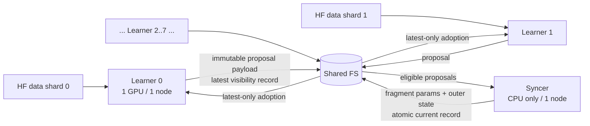

# 01. 系统架构与代码边界

## 1.1 运行拓扑



数据面只有共享存储。PBS、SSH、GitHub、MPI launcher 可作为控制面，但模型参数、proposal、quorum/readiness、global fragment 发布和 learner adoption 不得经由 RPC、NCCL、DDP、MPI collective 或 socket 传输。

## 1.2 推荐代码域

规格不强制目录命名；以下结构作为 Codex 默认，偏离须 ADR：

```text
src/fsdiloco/
  config/          # typed config、resolved/frozen manifest
  identity/        # run/model/fragment/content identities
  model/           # HF model loading、logical-layer registry
  fragmentation/   # layer-aligned partitioner、fragment map
  storage/         # STOR-01 abstraction、POSIX backend、fault/latency injection
  protocol/        # proposal/global records、eligibility、selection
  learner/         # inner loop、snapshot、publish、adopt
  syncer/          # readiness、grace、streaming merge、publication
  optim/           # pseudo-gradient、merge policies、outer optimizer
  recovery/        # learner/syncer restart
  telemetry/       # per-role structured events
  evaluation/      # frozen version-vector snapshot
  runtime/         # role entrypoints、stop/heartbeat
  cli/             # bootstrap、learner、syncer、checker、inspect
tests/
  oracle/
  unit/
  property/
  integration/
  concurrency/
  failure/
  system/
benchmarks/
  simulator/
  storage/
configs/
pbs/
tools/
evidence/
```

## 1.3 依赖方向

允许：

- `learner/syncer → protocol/storage/optim/telemetry`
- `model/fragmentation → identity/config`
- `storage backend → storage interface`
- `runtime → all role-level modules`

禁止：

- storage backend 依赖 learner/syncer 算法；
- telemetry 决定 authority；
- HF `Trainer` 或 scheduler 隐式拥有 outer/global 进度；
- learner 导入 syncer 的可变实现细节；
- protocol 直接调用 POSIX 路径而绕过 storage interface；
- evaluation 追逐 mutable latest。

## 1.4 核心接口

至少形成下列可测试边界：

```text
StorageBackend
  publish_immutable(payload, identity) -> PublishedObject
  publish_visibility(slot, record) -> None
  read_visibility(slot) -> record
  read_verified(identity) -> bytes/tensors
  list_fixed_slots(run_id) -> bounded slots
  inject_visibility_delay(policy)

FragmentMap
  from_hf_model(model, sync_dtype) -> immutable map + digest
  fragment_state_dict(model, fragment_id)
  apply_fragment(model, fragment_id, payload)

ProposalPolicy
  validate(metadata, current_state, consumed_frontier, config)
  select(candidates, config) -> deterministic selected set

MergePolicy
  accumulate(base_payload, local_payload, normalized_weight)
  finalize() -> merged pseudo-gradient

OuterOptimizer
  step(current_params, current_state, merged_gradient) -> new params/state

LearnerRole / SyncerRole
  step_once()
  recover()
  stop_at_safe_boundary()
```

接口名可调整，职责不可揉在一起。

## 1.5 存储对象模型

推荐逻辑布局；实际路径可变，但 discovery 面必须固定：

```text
<run_root>/
  run/manifest.json
  model/fragment_map.json
  globals/f<id>/current.json
  globals/f<id>/objects/<content-id>.{safetensors,json}
  globals/f<id>/bases/<version-or-content-id>/
  proposals/l<learner>/f<fragment>/latest.json
  proposals/l<learner>/f<fragment>/objects/<proposal-id>.{safetensors,json}
  control/bootstrap_complete.json
  control/run_complete.json
  telemetry/<role-id>/*.jsonl
```

`current.json` 与 `latest.json` 是小型 visibility records。大 payload 先写成不可变对象并校验，再原子替换 record。reader 只从 record 发现对象。

## 1.6 数据与模型状态

- learner 持有完整本地模型和独立 AdamW 类 inner optimizer；
- global authority 是各 fragment 的 `(parameters, outer state, version, consumed frontier)` 集合；
- learner model 和 global model 可以 mixed-version；
- outer optimizer state 按 fragment 独立；
- tied parameter 只有一个同步 owner；
- 稳态不物化、传输或发布完整模型；
- evaluation 才冻结 version vector 并组装完整模型。

## 1.7 控制与停止

- 每个角色写 heartbeat，但 heartbeat 不是正确性 authority；
- syncer 以 readiness 驱动，不按轮询次数推进；
- `global_cycle = min_f outer_update_count_f`；
- 门禁 run 在 `global_cycle >= 10` 时由 syncer发布完成 record，各 learner 在安全 optimizer boundary 停止；
- 故障注入 loop 可在完成 record 前按预注册计划 kill/restart；
- 任何停止都保留原始 logs、manifest 和未回收临时对象快照用于检查。
