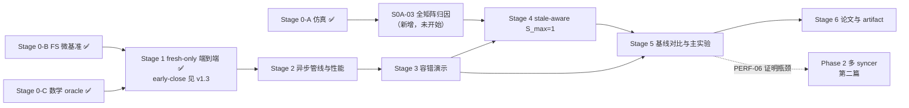

> **采纳说明**：本文件是 Claude 基于 Stage 0/1 证据提出的修订完成稿，修改点与
> 理由见 [04-research-plan-revision-notes.md](04-research-plan-revision-notes.md)
> （M1–M12）。采纳须走 §7 / Spec §13 变更控制：由用户批准、写 ADR、替换
> `source/RESEARCH_PLAN.md` 并更新 `SOURCE_HASHES.txt` 与 `PROGRESS.yaml` 哈希。
> 未采纳前，v1.3 仍是唯一权威版本。

# FS-Based Decoupled DiLoCo：从启动到论文完成的研究总计划

## 0. 文档定位

本文是**研究总计划**，回答四个问题：研究主张是什么、按什么顺序推进、每一步实现哪些特性、达到什么指标才算通过。

实现层面的规范性契约见 [STAGE0-4_SPEC.md](STAGE0-4_SPEC.md)（Stage 0–4 需求与设计规格，下称 Spec）；本文引用其条款 ID（INV/DISC/SIM/BENCH/MODEL/FRAG/LEARN/PROP/STALE/SYNC/OPT/GLOBAL/FS/PROG/PERF/REC-xx 与验收 A-xx）。Stage 5–6 与 Phase 2 的实验设计以本文为准，Spec §1.4 保证实现不阻碍它们。

### 0.1 三项关键设计决定

1. **stale 支持分阶段实现，但为必选特性**：Stage 1–3 以 S_max=0 配置运行（接口通用、行为先收窄，见 Stage 1 实现纪律与 Spec §1.6），Stage 4 无条件实现 S_max=1；Stage 0-A 仿真只用于参数选型与接受率预测，不决定 stale 取舍；若 H3 不成立，stale 作为 matched 对照下的负面结果如实报告。
   **【2026-07-16 触发记录（M1）】** Stage 0-A 已完成：预注册 Profile B 锚点的
   挽回预测为 **−0.0446 个百分点**（<3pp），按 Stage 0-A 篇幅表第三行，**C4 定位
   为消融/讨论章节**。本决定的"stale 必选实现"部分不变；Stage 4 的实验范围按
   本文 Stage 4 修订版执行（先归因、再定消融矩阵规模）。
2. **崩溃一致性与恢复在范围内**（Stage 3，Spec §7）：存储上有界权威状态使 crash-consistent restart 几乎免费，这是相对网络方案最不对称的优势，必须作为论文卖点而不是 non-goal。范围限定为 kill-restart 级别，不做 exact replay。
3. **fragment 策略默认 layer-aligned 连续均衡分片**（Spec §5.2；FRAG-05 的字节均衡目标已吸收大部分带宽收益）；balanced-tensor 作为 Stage 5 可选消融，论文中引用原论文"质量对分片策略稳健"的结论作为依据。

### 0.2 一句话研究陈述

> DiLoCo 系算法把同步频率降低了约两个数量级，使通信介质的延迟容忍度从微秒级放宽到秒级。我们据此论证：**存储本身可以充当去中心化预训练的通信介质**——协议只依赖"原子可见性发布"与"最终可读"两个存储原语，以单写者、有界状态的最小协调实现 Decoupled DiLoCo，天然获得崩溃一致的重启能力，并**评估有界 stale 聚合对 fresh-only 语义下被丢弃异构算力的回收边界**。POSIX 共享文件系统（HPC 中心，介质是被迫选择）与对象存储（跨区域高延迟环境）是同一协议的两个实例化；本篇主实验在前者上完成，并以可见性延迟扫描刻画协议的适用边界。

---

## 1. 研究问题、假设与论文主张

### 1.1 动机场景（论文第一节，必须写实）

**主场景（评估在此完成）**：HPC 中心的共享存储环境——介质是被迫选择：

- 多个 GPU 作业分属不同节点/分区/集群，共享同一 Lustre / GPFS / NFS / CHFS 文件系统；
- 作业之间不能建立长驻网络服务（调度器限制、防火墙、跨集群无路由）；
- 作业由批调度器独立启动、随时可能被抢占或重启；
- 现有替代方案（NCCL/RPC 参数服务器）在该场景下**不可部署**，而非仅仅不方便。

**主场景实例（已落地，M5）**：JCAHPC Miyabi（东京大学/筑波大学联合中心）——
GH200 计算节点、PBS Pro 批调度、项目级并发作业与节点配额、跨作业无长驻网络
服务、全节点共享同一 Lustre。Stage 0-B 在该系统上的实测（论文 motivation 的
一手数据）：跨节点可见性 p99 **7.95ms**（空载与负载两组、阈值的 1/300）；
10^5 次并发原子可见性替换 **0 违例**（unsafe overwrite 对照产生 5,208 次
detector 命中，证明检测器有效）；持续元数据吞吐下界 **39,403 ops/s**
（稳态轮询需求的 77 倍）；16 并发流写一轮 fragments 最坏 **0.324s**。
证据：`reports/stage0/storage_decision.md` 及其引用的两个不可变 run。

**次级主张（一般化，claim 与证据必须匹配）**：协议不依赖 POSIX 语义整体，只依赖两个存储原语——"原子可见性发布"（POSIX FS 上为原子 rename；对象存储上为原子 PUT / 条件写）与"最终可读"。因此同一协议可实例化到跨区域共享对象存储，覆盖 Decoupled DiLoCo 式高延迟环境中"参与方之间只有存储可达"的变体。证据要求：Stage 5 的注入式可见性延迟扫描（goodput 随延迟的退化曲线与可行域）+ **对象存储微基准（原 Stage 0-B 可选项 BENCH-05 未运行，现列为 Stage 5 必做廉价项，M8）**；**不承诺真实跨区域实验**，论文措辞相应限定。

注意切割：Decoupled DiLoCo 原文运行于跨区域 WAN，但仍以 RPC 在线服务通信——高延迟本身不构成使用存储介质的理由，"只有存储可共享"才是。

### 1.2 研究问题与假设

| ID | 研究问题 | 可证伪假设 |
|---|---|---|
| RQ1 | 共享 FS 能否作为 decoupled DiLoCo 的唯一通信介质，代价多大？ | **H1**：在 fragment 同步周期 ≥ 30s 的配置下，FS 传输开销占比 < 10%，learner GPU goodput ≥ 网络实现的 90% |
| RQ2 | FS 承载权威状态是否带来免费容错？ | **H2**：syncer/learner 任意时刻 kill -9 后重启，训练无损继续，恢复到下一次成功 outer update 的时间 ≤ 2× 正常 update 间隔，且不需要任何 replay |
| RQ3 | 有界 stale 聚合能否在异构速度下提升样本吸收率而不损害质量？ | **H3a（机制一致性，M2）**：在预注册 Profile B 锚点下 stale proposal 实际被接受，接受率与 Stage 0-A 预测偏差 ≤ 2×，挽回幅度与预测差 ≤ max(2×\|预测\|, 1.0pp)。**H3b（质量无损，M2）**：matched-token、≥3 种子下，S_max=1 与 fresh-only 的最终 eval loss 差 ≤ 多种子 ±1σ。**EQ3（探索性）**：是否存在参数区使挽回 ≥ 3pp——由 S0A-03 全矩阵归因（见 Stage 0-A 后续）先行判定，存在则 Stage 4 在该区实测验证 |
| RQ4 | 单 syncer 何时成为瓶颈，非重叠分片能否线性扩展？ | **H4**（第二阶段/第二篇）：非重叠多 syncer 在相同输入下数值等价，且聚合吞吐随 syncer 数近线性 |
| RQ5 | 协议的适用边界在哪里——可见性延迟多大时失效？ | **H5**：goodput 退化由"可见性延迟 ÷ fragment 同步周期"之比决定：比值 ≤ 5% 时 goodput 损失 ≤ 2%，且该曲线可外推对象存储/跨区域场景的可行域。（实测锚点：主场景自然工作点 delay/H_wall ≈ 0.1%，深处安全区内） |

> 原 H3（"S_max=1 将 accepted-token 效率提升 ≥10 个百分点"）在 Stage 0-A 预测
> 为负后不再作为验收假设；其内容由 EQ3 承接（M2）。**丢弃问题本身是真实的**：
> 锚点处 accepted-token 效率仅 33.5%、全矩阵 token 加权丢弃率最高达 88.8%——
> "被丢弃的算力去哪了、什么机制能回收"仍是论文要回答的问题，答案可能是负面的。

### 1.3 论文主张（claims）与证据映射

| Claim | 内容 | 证据来源（Stage） |
|---|---|---|
| C1 | 最小存储协调协议（单写者 + payload-first/visibility-last + 有界状态）足以正确支撑 decoupled DiLoCo，正确性只依赖"原子可见性发布 + 最终可读"两个存储原语（POSIX FS 以原子 rename 实例化） | Stage 0-B、1（0-B 与 Stage 1 端到端已交付） |
| C2 | 稳态 goodput 代价可量化且小（对照网络基线），且适用边界（goodput vs 可见性延迟）可刻画 | Stage 2、5 |
| C3 | 崩溃一致重启免费获得（对照：网络版 synchronizer 崩溃需状态重建）；范围限定 kill-restart（进程级），断电级持久性在 limitations 或以可选 durable 模式量化（M11） | Stage 3 |
| C4 | 有界 stale 聚合可**安全**启用（matched-token 质量无损），其挽回幅度被如实刻画并与仿真锚点一致；预测为负 → 以负面结果 + 机制归因入论文（**篇幅表已触发：消融/讨论章节**，M1） | Stage 0-A、4 |
| C5 | 发现成本、存储、单次 update 成本均有界，1000+ updates 无退化；syncer 容量曲线（update interval vs fragment 字节/M/Q）给出单 syncer 适用边界 | Stage 5 |

C1/C2/C3/C5 构成系统主线；C4 为算法副线，**无条件实现与评估**（§0.1 决定 1），按已触发的篇幅表以消融/讨论呈现；若 H3b 也失败（质量受损），回退 fresh-only 默认并如实报告。

### 1.4 相关工作切割面（写作前必须完成的定位）

1. **DiLoCo / Streaming DiLoCo / Decoupled DiLoCo**：算法机制（quorum、grace window、token 加权、fragment 通信）来自原论文；本工作的 delta = 传输介质（存储 vs 网络在线服务）+ 崩溃一致性 + 有界 stale 扩展。注意：原论文在高延迟 WAN 上以 fresh-only 工作良好，因此 stale 的动机是回收异构下被丢弃的算力，而非"高延迟必需"。不得声称聚合算法本身为新贡献。
2. **异步联邦聚合（FedAsync、FedBuff、gap-aware/DC-ASGD）**：`tokens/(1+λs)` 属多项式 staleness 衰减一族，必须引用并区分：本工作以 fragment 版本为 staleness 单位、以 Q_fresh 锚定、base-relative displacement 重建（Spec INV-07），而非梯度延迟补偿。
3. **基于存储/checkpoint 的训练系统**（弹性 checkpoint、Gemini、CheckFreq 一类）：它们用存储做容错，本工作用存储做**数据面通信**。
4. **参数服务器**：结构相似（中心聚合），但 PS 假设常驻网络服务与在线 RPC；本工作假设仅有文件系统与批作业。
5. **RDA（Radial-Directional Averaging）**：来自 Decoupled DiLoCo 原论文的 merge 策略，论文中必须给出定义与引用，不作为本工作贡献。

---

## 2. 实验总纲（所有阶段共用）

### 2.1 模型与数据

| 用途 | 模型 | 初始化（M6） | 数据 | token 预算 | 种子数 |
|---|---|---|---|---|---|
| 调试 / 数值验证 | ~160M dense decoder-only（Pythia/LLaMA 风格） | pretrained 允许 | FineWeb-Edu 或 C4，按 learner 独立 shard | 1–3B | 1 |
| 质量主张（C4/H3b、matched-token 对照） | 160M–410M | **必须 from-scratch** | 同上 | 接近 chinchilla（~3–8B） | **≥ 3** |
| 系统主张（C1/C2/C3/C5、长跑） | 0.5–1B | pretrained 允许；loss-trend 阈值须按初始化方式给出校准依据 | 同上 | ~5–10B（以系统稳态为目的，不追求收敛最优） | 1 |

原则：质量结论在小模型多种子上建立统计效力；系统结论在最大可负担规模上建立代表性。二者不混用。
**初始化冻结理由（M6）**：Stage 1 实测表明从 pretrained checkpoint 续训的 loss
下降信号微弱（9,217 步 ratio 0.9940 vs 门槛 0.99），以其校准"训练有效"类门槛
信噪比不足；质量比较必须消除预训练先验。

### 2.2 环境

- learner：M = 4（调试）/ M = 8+（主实验），每 learner 1 GPU、1 node（Spec §1.1）；
- syncer：1 CPU node；
- FS：目标共享文件系统至少一种真实并行 FS（已落地：Miyabi Lustre；NFS 可作对照点）；
- 异构场景：注入式减速（单 learner 恒定 ×0.7、lognormal 抖动）为参数扫描主力。
  **真实异构来源现状（M4）**：主平台 Miyabi-G 为同构 GH200 独占节点，原文
  "不同代 GPU 混用或共享节点争用"在该平台不可得。处理规则与 C4 定位联动：
  C4 处于消融/讨论定位时，注入式异构即可支撑；若 EQ3 判定 stale 有实质收益、
  C4 回升为主张，则必须补一次外部异构平台（部门集群/云混合实例）的小规模
  验证 run，并在风险表登记。

### 2.3 方法论红线（Spec §10 报告要求）

- 任何 stale-aware 结论必须同时给出 fresh-only 对照；
- 任何质量比较必须 matched-token，任何效率比较必须 matched-compute 或 matched-communication，并显式标注口径；
- 不得把"stale 提高吸收率"与"更多通信/更多 outer updates 的质量效应"混为一谈；
- 所有 run 的超参数在启动前冻结入实验记录；
- **（新增，M7）** 任何吞吐、goodput、容量结论的测量 run 不得包含人为 step
  pacing 或等效放慢机制；节奏/预算类门禁的通过不得依赖放慢任一角色；
- **（新增，M7）** 一切频率/预算类阈值（runtime 预算、cycle 目标、可见性预算）
  冻结前必须有单节点微基准或既有实测依据，预算余量 ≥ 10% 预测中位数；
- **（新增，M7）** 所有"延迟 ÷ H"类比值一律以实测 wall-clock H 计算并注明步时
  来源；H 以 steps 或秒表述时必须显式标注单位（历史教训：A-BENCH-04 曾把
  H=50 steps 按 50s 计算预算）。

### 2.4 核心度量定义（全文统一口径）

| 指标 | 定义 |
|---|---|
| GPU goodput | learner 训练吞吐（tokens/s）÷ 同配置关闭全部通信的本地吞吐 |
| accepted-token 效率 | 被成功聚合吸收的 token 数 ÷ 所有 learner 实际处理的 token 数 |
| discard rate | 因 base 版本失效/超限被拒的 proposal 占比（按 token 加权） |
| adoption lag | global fragment 发布到 learner 实际采用之间的本地步数/时间 |
| update interval | 同一 fragment 相邻两次成功 outer update 的间隔 |
| **syncer duty cycle（新增，M11）** | syncer 执行 update（读/merge/提交）的时间 ÷ 观察区间；容量余量的哨兵指标 |
| **覆盖丢弃率（新增，M3）** | 因 latest-wins 覆盖而从未被消费的 proposal 占比（按 token 加权）；丢弃归因的分项 |
| 恢复时间 | 进程重启到该角色首次成功完成其主循环动作（learner：首个 inner step；syncer：首次成功 publication） |

---

## 3. 阶段总览

状态（2026-07-16）：Stage 0 全部关闭（2026-07-15）；Stage 1 以用户批准的
early-close 关闭（v1.3 例外，原 1B-token 义务保留为未完成）。S0A-03 是新增的
纯分析步骤，零新算力，Stage 4 进入条件之一（M3）。

---

## 4. 分阶段计划

### Stage 0：预研验证（不写系统代码）——已完成（2026-07-15）

进入条件：无。原预估 2–3 周，实际约 7 小时 goal 时间（含排队与 Checker）。

#### Stage 0-A：离散事件仿真（参数选型与接受率预测）——已完成

原实现内容与验收（SIM-01..05、A-SIM-01..03）见 Spec §2，全部通过。

**实测结论（M1/M10）**：
- 完整 7,776 行矩阵、3 种子、2,592 个 profile 聚合，证据 run
  `20260714T145700Z-green3-resume-n7b4a-14126dde2f00`；
- Stage 1 Profile A 冻结：M=8、Q=Q_fresh=M、S_max=0、grace=0、λ=1、F=4、
  staggered H=50 steps；
- Stage 4 Profile B 预注册锚点：M=8、Q=4、Q_fresh=1、S_max=1、λ=1、grace 0.1H、
  异构 2×、可见性 1s——预测挽回 **−0.0446pp**、stale 接受率 **5.31%**、
  accepted-token 效率 **33.48%**；
- **篇幅表第三行（<3pp）触发**：C4 → 消融/讨论；同时按第三行要求"检查调度参数
  是否掩盖收益"——该检查由 S0A-03 承接。

| 预测的 stale 挽回幅度（accepted-token 效率提升） | 对论文的影响 |
|---|---|
| ≥ 10 个百分点 | C4 作为第二贡献，主文完整章节 |
| 3–10 个百分点 | C4 保留，篇幅压缩 |
| **< 3 个百分点（已触发）** | **C4 移至消融/讨论；同时检查调度参数是否掩盖了收益（→ S0A-03）** |

#### S0A-03：全矩阵归因分析（新增，M3）——未开始，Stage 4 前必须完成

零新仿真算力，直接消费既有 2,592 个 profile 聚合与种子级 CSV：

1. **recovery 全分布**：`accepted_token_efficiency(S_max=1) − (S_max=0)` 在全
   矩阵上的分布；报告是否存在 ≥3pp 的参数区及其位置（Q/M、异构比、grace、
   可见性延迟的哪个组合）；
2. **丢弃归因分解**：token 加权丢弃按原因分解——latest-wins 覆盖、base 过期
   （too-stale）、quorum 已满未选、grace 截止；解释锚点处 33.5% 效率的构成
   （全矩阵效率 mean 49.2%、min 8.9%、max 98.4%，方差主要来自哪个轴）；
3. **预注册决策规则**：存在有效区 → Profile B 锚点经 ADR 迁移至该区、Stage 4
   消融矩阵保留全轴；不存在 → Stage 4 消融矩阵裁剪（见 Stage 4 修订），
   多种子预算只用于 H3b。

交付物：归因报告 + 决策记录；同时作为论文 C4 章节的机制分析素材。

#### Stage 0-B：目标 FS 微基准（论文一手数据）——已完成

原实现内容与验收（BENCH-01..04、A-BENCH-01..04）见 Spec §3，全部通过。

**实测结论（M5/M10）**：跨节点可见性 p99 7.95ms；10^5 次原子替换（256/4096B
两种记录、4 readers）0 违例，unsafe 对照 5,208 hits；元数据吞吐下界
39,403 ops/s（需求 77×）；16-stream 写最坏 0.324s。决策 `PASS`：Stage 1 起用
冻结的 Miyabi Lustre 路径，无需缓解方案。**BENCH-05（对象存储）未运行**——
该旁证义务移至 Stage 5（M8）。证据：`reports/stage0/storage_decision.md`。

#### Stage 0-C：数学 oracle（Spec §4）——已完成

A-ALG-00 通过：`G^v − L_stale` 错误实现被拒；全部 golden cases 通过并可在 CI
重复。注意事项（供 Stage 4 使用）：s=1 golden cases 当前绑定 torch merge 参考
路径，Stage 4 启用时必须同时覆盖生产 merge 后端（见 reflection 02 §1）。

---

### Stage 1：fresh-only 最小端到端系统 —— 已关闭（2026-07-16，early-close）

原预估 4–6 周，实际约 2 天。关闭方式：2026-07-16 用户批准的一次性 early-close
例外（v1.3、`reports/stage1/S1-13-early-close-adr.md`）。**原 ≥1B-token 义务
保留为未完成**，后续引用该 run 只能作为部分训练/趋势/runtime 证据。

（原实现纪律、五个 stale-ready 要素、实现特性与验收指标全文保留如 v1.3，
此处不再复制；验收指标 4 的 early-close 措辞以 v1.3 为准。）

**未清偿义务（M9 时间线的输入）**：一次完整的 160M、M=4、真实 FS、≥1B token
long run。建议在 Stage 2 的 L4 测量 run 中以双重用途（预注册）完成，避免单独
排一次长跑。

---

### Stage 2：异步管线与性能加固 —— 预计 1–2 周（agent 实现）+ 长 run wall-clock

进入条件：Stage 1 验收通过（early-close 例外已记录）。覆盖 Spec §6。

实现特性：
- GPU→CPU staging→FS 后台发布管线与训练重叠（LEARN-05、PERF-02）；
- FS→CPU→GPU 后台采用管线，安全边界短暂停（LEARN-08、PERF-02）；
- 有界 backpressure：latest-wins pending snapshot、单 in-flight publication、跳过发布（LEARN-06、PERF-03/05）；
- telemetry 全量落地（TEL-01..03）。

验收指标：
1. **GPU goodput ≥ 95%**（对照关闭通信的本地吞吐，160M 与 1B 模型各测一次）；
2. 快照与采用引起的训练暂停合计 ≤ 2% 步时间；
3. 慢 FS 注入（人为限速至正常 1/10）下运行 ≥ 2 小时：pending 队列、临时对象数有界（A-PERF-02），learner 吞吐不受影响；
4. 产出端到端延迟分解报告（快照/写/发现/读/采用各占比）——这是论文 C2 的图；
   **分解必须包含 syncer duty cycle 与 per-fragment update interval（M11）**，
   作为单 syncer 容量风险（§5）的哨兵观测；
5. **（新增，M7）** 以上全部测量在无人为 pacing 的配置下进行；goodput 分母的
   "关闭通信本地吞吐"必须使用与分子完全相同的确定性/精度/telemetry 设置。

---

### Stage 3：容错演示 —— 预计 1 周（agent 实现）+ 注入矩阵 wall-clock

进入条件：Stage 2 通过。覆盖 Spec §7（§0.1 决定 2）。

实现特性：
- learner 崩溃恢复：从 FS 拉取当前完整 global model + 版本向量，重建 inner optimizer（最简版直接重新初始化），counters 归零，继续训练（Spec REC-01）；
- syncer 崩溃恢复：读 per-fragment current 引用即恢复全部权威状态，忽略 base 不匹配 proposal，继续聚合（Spec REC-02）；
- 发布中断原子性：kill 于 publication 各阶段，重启后只能观察到旧完整或新完整状态（A-GLOBAL-01 扩展）。

**范围再确认（新增，M11，Stage 3 ORIENT 必答）**：当前发布路径对进程级
kill -9 完备，对节点断电不完备（可见性记录可能指向页缓存中丢失的 payload，
读侧 fail-closed 保证安全性但可用性需人工恢复）。三选一并写 ADR：
(a) C3 论文措辞明确限定进程级 crash；(b) 增加可配置 durable-publish 模式
（fsync 链）并量化其代价作为论文数据点；(c) 实现 FS-06 的"上一完整 current
记录"自动回退链。

验收指标：
1. syncer kill -9 → 重启 → 下一次成功 outer update 的间隔 ≤ 2× 正常 update interval，重复 10 次不同时机注入全部通过；
2. learner kill -9 → 重启 ≤ 5 分钟恢复训练，全局 loss 曲线除该 learner 贡献暂缺外无跳变；
3. 发布中断注入矩阵（payload 写入中 / 可见性记录替换前后）全部只出现两种合法结果；
4. 少于 quorum 的 learner 存活时，受影响 fragment 停止前进、其余 fragment 正常（Spec REC-04），恢复后自动继续。

产出：恢复时间表 + kill 注入矩阵报告——论文 C3 的证据，也是与网络基线差异化的核心素材。

---

### Stage 4：stale-aware 扩展 —— 预计 1–2 周 + 多种子 wall-clock（必选，§0.1 决定 1）

进入条件：Stage 3 通过 **且 S0A-03 归因完成（M3）**。本阶段无条件执行；仿真
预测作为验收锚点与论文篇幅依据（篇幅表已触发，见 §0.1）。覆盖 Spec §8。

实现特性（得益于 Stage 1 的通用接口，本阶段新增收敛为以下四项）：
- 前一 base parameter payload 的保留与 GC（STALE-03，窗口从 1 扩到 S_max+1）；
- 基于旧 base 的 displacement 重建（INV-07/STALE-04）——Stage 0-C 的 s=1 golden cases 在此启用，**且必须覆盖生产 merge 后端**；
- Q_fresh ≥ 1 锚定（STALE-06）、确定性候选选择（STALE-07）、same-base 一次消费（PROP-06/STALE-08）、too-stale/missing-base/future-base 拒绝（INV-06）；
- 拒绝原因分类计入 telemetry（STALE-10、TEL-02）。

消融矩阵（同一二进制，只翻配置；质量口径 matched-token）——**规模由 S0A-03
决策规则决定（M3）**：

| 情形 | 矩阵 |
|---|---|
| EQ3 判定存在 ≥3pp 有效区 | 全矩阵保留：S_max {0,1}、λ {0.5,1,2}、Q_fresh {1,0}、异构比 {1.0,1.5,2,3}；锚点经 ADR 迁移 |
| 不存在（预期情形） | 裁剪为：S_max {0,1} 主对照 + λ {1} + 异构比 {1.5, 3}；Q_fresh 轴与其余 λ 档砍掉；多种子预算全部给 H3b |

验收指标（M2 重写）：
1. Spec 验收矩阵 A-STALE-01..07、A-PROP-04..05 全部有自动化证据；
2. **Profile B 通过 / H3a 机制一致性**：异构注入下 stale proposal 实际被接受，
   接受率 > 5% 且与仿真预测偏差 ≤ 2×；实测挽回与预测差
   ≤ max(2×\|预测\|, 1.0pp)（等价带，替代原"≥ 预测的 50%"——该式在预测为负时
   为空条件）；
3. **H3b 质量无损检验**（matched-token，160–410M from-scratch，≥3 种子）：
   S_max=1 与 fresh-only 的最终 eval loss 差 ≤ fresh-only 多种子 ±1σ；
4. 若 H3b 失败（质量受损超阈值）：回退默认为 fresh-only，stale 降级为负面结果
   报告（负面结果照样入论文，matched 方法论使其仍有价值）；
5. 无论 EQ3 结果如何，C4 章节必须包含 S0A-03 的丢弃归因图（丢弃从哪来、
   S_max=1 为什么只挽回 ~5% 接受率下的 ~0pp 效率）。

---

### Stage 5：外部基线与主实验 —— 预计 3–4 周（wall-clock 主导；基线搭建可与 Stage 4 并行）

进入条件：Stage 3 通过（stale 线可后并入）。本阶段实验设计以本节为准；长跑的有界性验收沿用 Spec 跨 Stage 条目（A-PERF-03）。

实现特性：
- **外部基线 1（必需）**：最小网络版 decoupled 聚合器——同一套 learner/聚合逻辑，数据面换成 TCP/gloo 直连 syncer。目的只有一个：量化 C2 的"FS 代价"；
- **外部基线 2（必需，廉价）**：naive FS 方案——每 H 步整模型 checkpoint 交换，证明 fragment 协议相对天真存储方案的收益；
- **外部基线 3（可选）**：全同步 DiLoCo（Q=M、阻塞）作质量锚点；
- **注入式可见性延迟扫描（必需，支撑 H5 与高延迟一般化）**：测点 **0/1/5/30s
  （与 Stage 0-A 建议一致；10s 为可选加密测点，M8）**，测量 goodput、丢弃率、
  adoption lag 随延迟的退化曲线，导出可行域（"可见性延迟 ÷ 实测 wall-clock
  同步周期"阈值，单位口径见 §2.3）；预计 2–3 天工作量；
- **对象存储微基准（必需，廉价；自 Stage 0-B BENCH-05 移入，M8）**：在任一
  S3 兼容存储上执行原子 PUT/条件写语义 + 可见性延迟微基准，为 §1.1 次级主张
  提供最低限度旁证；预计 1–2 天；
- **syncer 容量刻画（必需，新增，M8）**：update interval 与 duty cycle 随
  fragment 字节数、M、Q 的曲线（160M 与 0.5–1B 两个规模）；它同时是 C5 的
  有界性证据、C2 延迟分解的归因基础与 Phase 2（PERF-06）的启动证据；
- merge 对照：direct averaging vs RDA（非 embedding fragments），matched-token 一组即可（经 Spec OPT-02 的可插拔 merge 接口）；
- balanced-tensor 分片消融（可选，§0.1 决定 3）；
- **长跑**：目标 FS、M≥8、0.5–1B 模型、≥1000 次 fragment outer updates、异构
  注入场景（真实异构按 §2.2 的联动规则处理）。

验收指标：
1. **H1 检验**：FS 版 GPU goodput ≥ 网络基线的 90%（不达标则如实报告差距并给出延迟分解归因——claim 改写，不掩盖）；
2. 对 naive FS 基线：峰值带宽、单步暂停、可扩展性至少一项有 ≥ 2× 优势；
3. **C5 证据**：1000+ updates 中 discovery latency 与存储用量对 update 序号做线性回归，斜率与 0 无显著差异（A-PERF-03）；
4. **H5 检验**：延迟扫描曲线 ≥ 5 个测点；"延迟 ≤ 5% 同步周期时 goodput 损失 ≤ 2%"成立或据实修正阈值；论文以该曲线给出对象存储/跨区域场景的可行域外推；
5. **syncer 容量曲线交付（M8）**：两个规模、至少 3 个 fragment 尺寸测点，报告
   duty cycle 与外推的单 syncer 适用边界；
6. 完整报告 §23 要求的全部量（staleness 分布、weight mass、adoption lag、bytes/token、goodput、syncer/FS 成本）；
7. 独立 Checker 按 Spec §9 的 CHECK 协议出具 PASS 或 PASS_WITH_FOLLOWUPS。

---

### Stage 6：论文写作与 artifact —— 预计 3–4 周（与 Stage 5 尾部重叠）

实现内容：
- 论文：动机场景（§1.1，含 Miyabi 实测实例）→ 协议设计（C1）→ FS 特性（Stage 0-B）→ 性能（C2）→ 容错（C3）→ stale 消融与机制归因（C4，含 S0A-03 图）→ 有界性与 syncer 容量边界（C5）→ related work 切割（§1.4）；
- claims→证据表（§1.3）逐条核对，每条 claim 至少一图/一表；
- artifact：一键复现脚本（仿真、微基准、160M 端到端）、冻结配置、README；Spec 验收矩阵（§11）的自动化测试即 artifact 的功能性证据；
- 负面结果与限制章节：明确"何时不该用这套方案"（可见性延迟 vs H_wall 的适用边界、单 syncer 容量边界、断电级持久性的范围限定）。

完成定义：全部 claims 有证据支撑；Spec §11 验收矩阵与本文各 Stage 验收全部满足；repo 可从零复现 160M 规模全部主图。

---

### Phase 2 边界：多 syncer 非重叠分片（第二篇/扩展，不在本计划交付内）

启动条件（Spec PERF-06 profile-first 门槛）：Stage 5 profiling 证明单 syncer 在 CPU merge、FS 吞吐或 metadata 中的具体瓶颈。约束（Spec §1.4）：静态非重叠 ownership、单写者、相同输入数值等价、暂不做 failover。对应 RQ4/H4。

**初步信号注记（M12）**：Stage 1 实测单 syncer 串行处理在 160MB fragment 时
~1.06s/update、duty cycle ~61%；外推 0.5–1B 模型时余量可能跌破 1。PERF-06 的
正式证据预计由 Stage 2 延迟分解与 Stage 5 容量曲线自然产出；本篇仍不引入多
syncer。

---

## 5. 风险登记表（M4 修订）

| 风险 | 状态/信号 | 缓解 |
|---|---|---|
| ~~FS 可见性延迟过大~~ → 仅存于一般化语境 | **主场景已排除**：Miyabi Lustre p99 7.95ms（Stage 0-B）。对象存储实例化场景仍未测 | Stage 5 对象存储微基准 + 延迟扫描给出可行域；论文 limitations 引用 |
| 单 syncer 发布/聚合容量不足（**新增**） | **已有信号**：S1 实测 1.06s/update@160MB、duty 61%；update interval 增长 → adoption lag → 有效 staleness 上升 | Stage 2 duty cycle 哨兵指标；实现层并行读/流水线（见 reflection 01 §2）；调大 H；fragment 字节缩减；证据同时喂给 Phase 2 |
| fresh-only 丢弃率高、stale 挽回不足 | **已触发**：锚点预测挽回 −0.045pp、效率 33.5%（Stage 0-A） | S0A-03 归因 + 决策规则（M3）；C4 已按篇幅表降级；负面结果路径预注册 |
| 真实异构来源不可得（**新增**） | Miyabi-G 同构 GH200 独占节点 | C4 为消融定位时注入式异构即可；EQ3 翻盘时补外部异构平台一次验证（§2.2） |
| 高延迟一般化主张被质疑证据不足 | 评审意见：未跑真实 WAN | 主张限定为"两个存储原语 + 可见性延迟可行域"（§1.1）；证据为延迟扫描曲线 + 对象存储微基准（已升为必做）；论文明示不承诺真实跨区域实验 |
| stale 损害质量 | Stage 4 H3b 失败 | 回退 fresh-only 默认，stale 作为有 matched 对照的负面结果报告 |
| 网络基线做不出来（环境不允许） | 集群无法开端口 | 同一 co-allocated job 内以 gloo 建基线（作业内网络可用）；不可行时在开发集群测基线，论文明示两环境差异 |
| GPU 小时/队列成为日历瓶颈（**新增**） | 实现不再是关键路径（Stage 0+1 实际 ~2 天 vs 预估 6–9 周）；长跑与多种子 wall-clock 主导 | §6 预算表提前排程；多 run 并行提交（配额 16 并发作业）；双重用途 run 预注册 |
| 1B 规模预算不足 | 资源申请失败 | 系统主张降到 410M + M=8；质量主张不受影响（本就在小模型多种子） |
| 时间线超期 | 各 Stage 超预估 50% | 见 §6 投稿策略降级路径 |

---

## 6. 时间线与投稿策略（M9 重估）

**实际进度记录**：Stage 0（预估 2–3 周）实际约 7 小时 goal 时间；Stage 1
（预估 4–6 周）实际约 2 天（2026-07-14 → 07-16，269 commits）。v1.3 §6 的
切换条件"仅当 Stage 0–1 显著快于预估时选择激进"**已客观触发（约 20×）**。

**关键路径转移**：实现（agent 执行）不再是瓶颈；剩余日历时间由长 run
wall-clock、多种子矩阵与队列决定。粗粒度预算（按 S1 实测 160M ~11k tokens/s/
learner 量级估计，无 pacing 后预计更快）：

| 项目 | wall-clock 量级 |
|---|---|
| Stage 2：goodput 对照（160M+1B 各一次）+ 2h 慢 FS run + 补 1B-token 长跑（双重用途） | ~1–2 天累计 |
| Stage 3：kill 注入矩阵（10+ 次，短 run） | ~1 天累计 |
| Stage 4：H3b matched-token（160–410M×2 臂×≥3 种子×3–8B tokens） | 每 run 数小时–1 天，可并行；累计 ~3–7 天 |
| Stage 5：长跑（0.5–1B、1000+ updates）+ 延迟扫描 + 基线 | ~1–2 周累计 |

**修订时间线**：Stage 2–3 预计 2026-08 上旬完成；**checkpoint 评审提前至
Stage 3 结束（约 2026-08 中）**，届时用真实的 Stage 2/3 复杂度校准以下决定：

| 方案 | 目标 | 截稿（约） | 条件 |
|---|---|---|---|
| **主目标（修订推荐）** | MLSys 2027 | 2026-10 底（往届规律，待官宣） | Stage 2/3 无未知复杂度爆炸；GPU 配额可支撑 §6 预算表；C4 以消融/讨论定位（已确定）不占主文预算 |
| 保底 | HPDC / EuroSys（春季轮）/ ICML 系统 track | 2027-01 至 2027-04 | checkpoint 评审判定主目标不可达时自动降级；内容不砍，只延后 |

降级触发条件（任一即降级）：Stage 2 或 3 单阶段超 3 周；Stage 5 长跑两次失败
且根因未闭合；GPU 配额申请失败。

---

## 7. 执行纪律

- 每个 Stage 遵循 Spec §9 的 Loop Engineering 协议（ORIENT→…→PERSIST），验收证据落盘；
- 每个 Stage 结束产出一页 checkpoint 报告：通过的验收 ID、未通过项、关键决策记录、对本文或 Spec 的变更提案；
- 本文的关键设计决定（§0.1）与 Stage 0-A 篇幅表一经触发即记录结论，不得事后追改口径（**触发记录见 §0.1 决定 1，2026-07-16**）；
- 频率/预算类阈值冻结前必须给出微基准或既有实测依据（§2.3 红线）；
- Spec（STAGE0-4_SPEC.md）是 Stage 0–4 实现的唯一契约：本文引用的条款 ID 以其当前版本为准，Spec 修订须在其变更记录（Spec §13）中注明由哪个 Stage 的证据驱动。

---

## 附：变更记录

- **v1.4-draft-claude（2026-07-16）**：基于 Stage 0/1 证据的修订草案（修改点
  M1–M12 见 reflection/claude/04）：记录 Stage 0-A 篇幅表触发（C4 → 消融/讨论）；
  H3 拆分为 H3a/H3b + 探索性 EQ3，修复 Stage 4 验收指标 3 在预测为负时的空条件
  缺陷；新增 S0A-03 全矩阵归因（Stage 4 进入条件）与消融矩阵裁剪规则；风险表
  按实测更新（可见性风险降级、新增 syncer 容量/真实异构/GPU 小时风险）；§1.1
  写入 Miyabi 实测实例；§2.1 冻结初始化方式；§2.3 新增测量红线（无 pacing、
  阈值微基准依据、H 单位口径）；Stage 5 增补对象存储微基准（自 BENCH-05 移入）
  与 syncer 容量刻画；§6 按实际进度重估，主目标改为 MLSys 2027、checkpoint
  评审提前至 Stage 3 末。算法语义、协议不变量、Spec 条款引用与 Stage 1
  early-close 例外均未改变。
- **v1.3（2026-07-16）**：按用户显式指令加入一次性 S1-13 early-close 例外。原
  1B-token、cycle、loss-ratio、scheduler 和 package 未通过事实完整保留；论文或
  后续阶段不得把部分 run 写成完成的 1B-token evidence。算法、Stage 1 acceptance
  IDs 与后续研究方法学不变。
- **v1.2（2026-07-14）**：实现契约切换——原上游文档（V1 SPEC 与 v1.md）废弃并移除，新契约为 STAGE0-4_SPEC.md（v2.0），按最新计划直接产出 Stage 0–4 详细规格；§0 重写为独立的"三项关键设计决定"，不再引用旧文档；全文条款引用同步更新（S1-xx 子阶段编号取消、恢复语义改用 REC-xx、Profile 与验收指向新 Spec 章节）。
- **v1.1（2026-07-14）**：采纳"高延迟环境一般化"假设与"S_max=0 先行、接口通用"实现策略——(1) 裁决 1 改写：stale 为必选实现，Stage 4 无条件执行，Stage 0-A 从 Go/No-Go 改为参数选型与接受率预测；(2) §1.1 场景重构为"HPC 主场景 + 存储原语抽象的次级主张"，并明确与 Decoupled DiLoCo WAN 场景的切割；(3) 新增 RQ5/H5 与 Stage 5 注入式可见性延迟扫描（必需项）；(4) Stage 1 新增"接口通用、行为先收窄"实现纪律与五个 stale-ready 要素；(5) Stage 4 收敛为四项新增工作并加入消融矩阵；(6) Stage 0-B 增加可选对象存储微基准；风险表相应更新。
- **v1.0（2026-07-14）**：初版。
